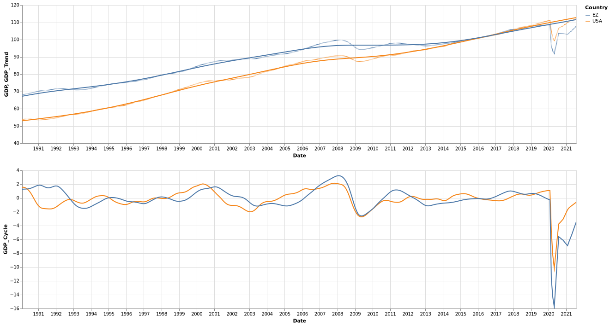
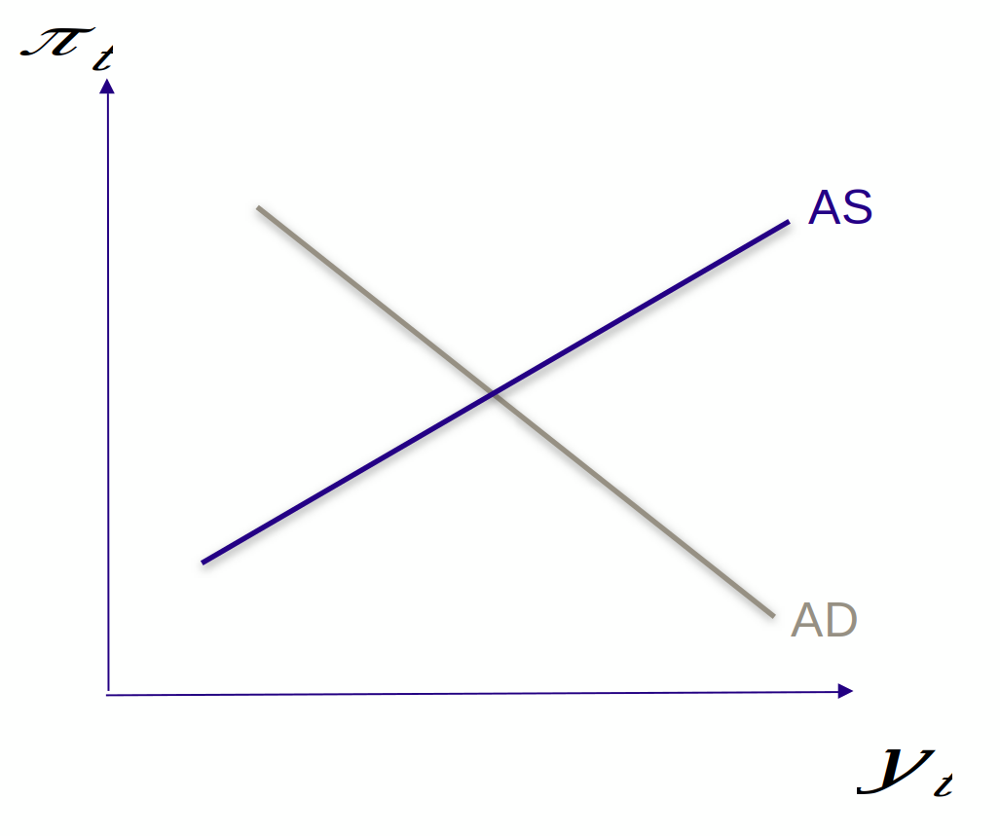
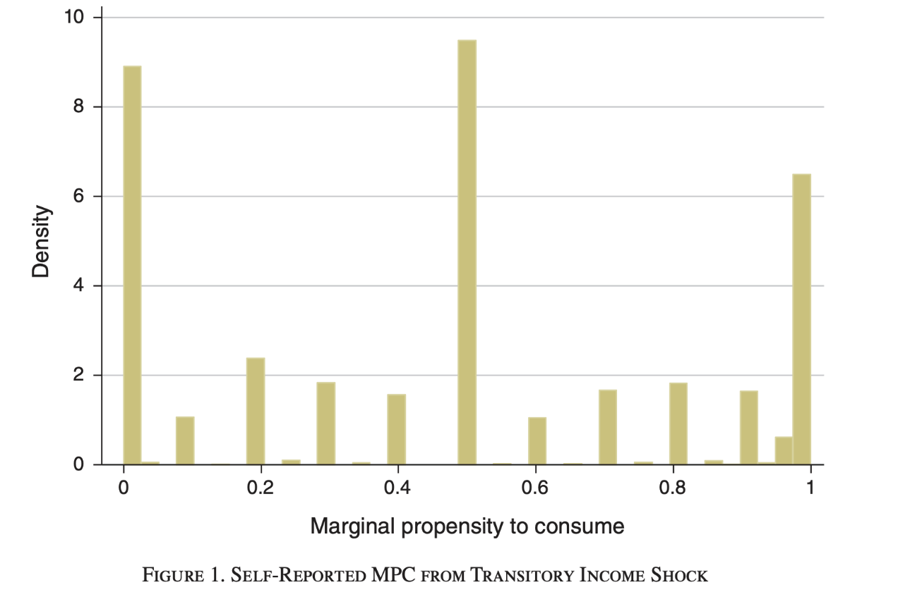
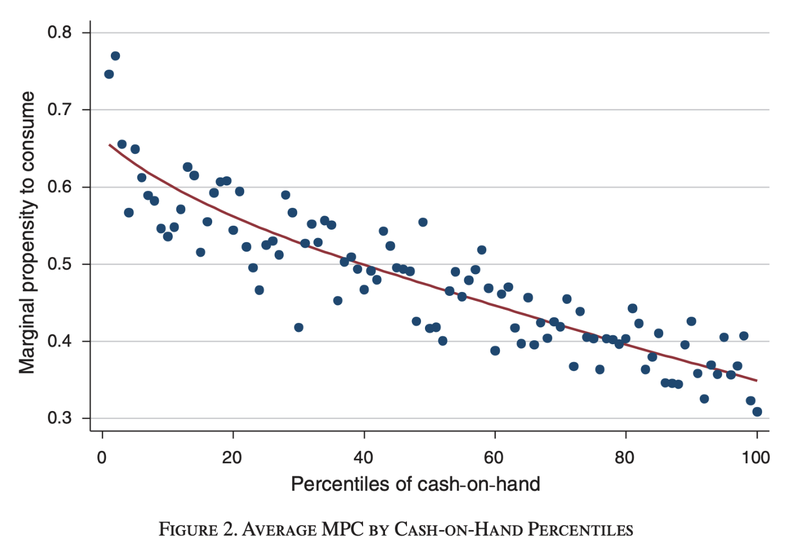

## Intro

---

### La semaine dernière

- PIB potentiel : fluctuations et cycles
- Consommation:
    - optimisation des consommateurs (fondamental)
    - agents keynesiens (qui ne peut pas s'endetter)
- Relation fondamentale:
$Y = C + I + G + NX$

---

### Cette semaine

- Intro au modèle AS/AD
- Les *autres* composants de la demande agrégée

---

## Le modèle classique

- conclusions simples:
- une baisse de la production peut résulter
  - d'une baisse de la demande (avec une baisse des prix)
  - d'une baisse de la production (avec une hausse des prix)
- une hausse des prix peut résulter
  - d'une réduction de la production
  - d'une hausse de la demande

---

## Regardons les cycles depuis 20 ans.

- offre ou demande ? regardons les prix

---

## Regardons les cycles depuis 20 ans.

---

## Comment identifier chocs d'offre et de demande ?

- Le modèle classique ne marche pas si bien
    - Comment identifier les choc?
    - Example: la crise du covid est-elle un choc d'offre ou de demande?
- Dans les données de comptabilité nationales, on a tojours "Revenu=Production"
    - les courbes d'offre et de demande ne sont pas directement observables dans les données
- On peut cependant définir des "concepts" correspondant à offre et demande. On les appelle:  "Offre Agrégée" (OA ou en anglais AS) et "Demande Agrégée" (OD ou AD)

---

## Quels sont les éléments du modele AS/AD?

- DA: definition
- OA: definition

Les définitions des courbes posent plusieurs problèmes.

---

## Probleme 1:

- Pourquoi la courbe de demande est-elle décroissante?
- Les Keynésiens: lorsque les agents deviennent plus riches (ou les prix réels plus bas), ils consomment plus, ce qui augmente la production
    - remarquez bien la différence avec une courbe de demande normale
- Les Néo-keynésiens 
    - essayer de formaliser (=microfonder) le comportement des agents pour calculer la demande agrégée (-> session 2)
    - obtenir un modèle sans irrationnalité, donc robuste à la critique de Lucas
- L'existence de la courbe AD n'est pas controversée dans la profession
  - Mais il y a un gros débat sur sa pente

<!--- pourquoi la demande n' est pas juste infinie? --->

---

## Probleme 2: l'offre agregégée

- A l'inverse, il n'est pas évident que la courbe d'offre soit croissante avec une pente finie
- A long terme, quand tous les marchés sont à l'équilibre, elle devrait être verticale. Changer la demande n'aurait alors aucun effet
  - Le point de vue des monétariste (Friedman)
- Et à court terme? La courbe pourrait être horizontale, croissante, verticale...
- La pente de la courbe (OA) est cruciale pour l'efficacité des politiques de demande.
  - sur le graphe, la politique de demande est plus importante pour AS1
- Classique: les prix sont flexible, la courbe d'offre est verticale
- Keynésiens (ISLM): les prix sont absolument rigides, la courbe d'offre est horizontale
- Néo-keynésiens: la courbe d'offre est croissante à cause d'une friction ou d'une inefficacité (voir amphi 3)

---

## Aperću: notre modèle de base

- Demande agrégé (version IS-MP)
    - IS: $y_t=\theta_t - \sigma (r_t-r)$
    - MP: $r_t = \overline{r} + \gamma (\pi_t - \overline{\pi})$
    $$AD: y_t = \theta_t - \sigma \gamma (\pi_t - \pi)$$
- Offre agrégé:
$$AS: \pi_t=\pi_{t-1}+\kappa (y_t - y^n_t)$$
- Votre but: comprendre d'où viennent ces équations, et comment les utiliser
- Les variables:
    - minuscules, log-deviations  par rapport à l'état stationnaire
    - lettres grecques: paramètres positifs
    - $r_t$: taux d'intérêt réel ($r_t = i_t -\pi_t$)
    - deux type de chocs:
      - $\theta_n$ demande
      - $y_t^n$ offre (choc sur PIB potentiel)

---

## Aperću: notre modèle de base (2)

  $AS: \pi_t=\pi_{t-1}+\kappa (y_t - y^n_t)$
  $$AD: y_t = \theta_t - \sigma \gamma (\pi_t - \overline{\pi})$$

- Remarques sur notre modèle:
  - il est intertemporel: variables en $t-1$ et en $t$.
- Il unifie le court terme et le moyen terme. On peut simuler le retour à l'équilibre
- A la date $t$, l'inflation passée est prédeterminée
- On peut donc représenter OA/AD dans le plan ($y_t, \pi_t$).

Remarque: etant donné $\pi_{t-1}$ les plans $(y_t,p_t)$ et $(\pi_{t},y_t)$ sont equivalents.

[quizz]: différence entre court terme, moyen terme et long terme?

---

## Preview Our baseline model (3)

TODO: supprimer ou déplacer.

- Notre modèle néo-keynésien
    - a un mécanisme de demande
    - et une courbe d'offre non-verticale
- Est micro-fondé
    - Les agents (ménages & firmes) prennent des décisions optimales
    - Des rigidités nominales impliques une élasticité de court terme de la demande
- Est intertemporal
    - Dynaymique (peut être utilisé à court terme ou pour la transition)
    - A court terme il donne une représentation OA/OD
    - A long terme il coincide avec la vision classique
    - on parle de "synthèse" néo keynésienne (ou néoclassique)

---

## La demande agrégée - la courbe IS

---

### Les composants de la demande agregee

- Rappel: $$Y = C + I + G + NX$$
    - Ce n'est pas un modèle, c'est une relation comptable.

- Donc $C + I + G + NX$ est la demande agregee?
    - NON!

- On va montrer que les *composants de la demande agrégée*, $C,I,G,NX$ dépendent du
    - revenu $Y$ (+) 
    - taux d'intéret réel $r$ (-)

---

### La courbe IS

- En macroéconomie la demande est caractérisée par l'équation $$Y = C(Y,r)+I( r )+G+NX( r )$$ qui lie implicitement production et taux d'intérêt réel.
- Cette relation s'appelle la courbe IS (pour Investment-Saving) parce qu'elle provient d'un arbitrage intertemporal (au travers du taux d'intérêt réel)
- Elle correspond à l'équilibre sur le marché des biens et services, qui serait déterminé uniquement par les dépenses prévues, avec une production parfaitement élastique.

---

## La consommation

---

### Consommateurs (1)

- Étant données ses préférences, un consommateur prend ses décisions de consommation en fonction de:
    - son revenu aujourd'hui $Y_t$)
    - son revenu futur (plus précisément le revenu qu'il anticipe)
- Etant donné le revenu, la décision de consommer est un arbitrage entre la consommation aujourd'hui et la consommation future.
- Cet arbitrage dépend du taux d'intérêt réel $r$ (le prix de la consommation aujourd'hui).
- On peut modéliser cet arbitrage en supposant que les agents sont rationnels mais ont une préférence pour le présent ($C_t$ consommation, $N_t$ travail):
    $$\max_{C_0, C_1, C_2 ...}  E_0 \left[ \beta^t U(C_t) \right] \text{ou}\max_{C_0, C_1, C_2 ...}  E_0 \left[ \beta^t U(C_t, N_t) \right]$$

---

## Les deux grands types de consommateurs (rappel)

- Agents __keynésiens__
    - leur consommation est limité par une contrainte d' endettement
    - par ex $C^K(Y^K_t) = c^K_0 + c^K_1 Y^K_t$
    - propension marginale à consommer $c_1$ proche de 1.
- Agents __ricardiens__
    - il peuvent lisser leur consommation dans le temps
    - consomment une (petite) partie de leur revenu permanent ($0<\xi\approx 0$):
        $$\begin{eqnarray}
        C^R(Y^R_t) & = & \zeta  \left(Y_t + \frac{1}{(1+r)}Y_{t+1} (...)\right)\\
        C^R(Y^R_t) & \approx & c^R_0 - c^R_1 r_t
        \end{eqnarray}$$
    - répondent peu aux choc temporaires de revenu
    - réagissent au taux d'interêt

---

## Agrégation

- Supposons qu'on ait 
  - une part $\lambda$ d'agents keynésiens $$C^K(Y^K_t) = c^K_0 + c^K_1 Y^K_t$$
  - une part $(1-\lambda)$ d'agents ricardiens: $$C^R(Y^R_t) = c^R_0 - c^R_1 r_t$$
- Peut-on facilement agréger les consommations pour obtenir
$$C(Y) = c_0 + c_1 Y + c_2 r_t ?$$
    - oui mais il faut connaître comment se distribue le revenu $Y_t$ entre les deux types d'agents
    - par exemple si $\frac{Y^K_t}{\lambda} = \frac{Y^R_t}{1-\lambda}$ (pas d'inégalité) alors $c_1 = \lambda c_1^K  + (1-\lambda)c_1^R$
- Intuitivement: plus la part $\lambda$ de ménages keynésiens, plus la mpc agrégée est élevée (*)
- Au fait, quelle est la proportion d'agents keynésiens?

---

### Propension marginale à consommer et distribution des revenus

Japelli and Pistaferri, *politique fiscale et hétérogénéité des propensions marginales à consommer* (2017)

---

### Pourquoi les agents sont-ils contraints?

#### Contrainte de liquidité et inégalité de richesse.

---

## Discussion

- D'après le premier graphe, il y a trois grandes catégories de MPC, pas deux
  - Elevée
  - Faible
  - Intermédiaire: qui est dans cette catégorie?
- Le deuxième graphe suggère que le revenu disponible est un bon prédicteur de la MPC
- Revenu disponible: revenu restant après paiement des dépenses contrainte
- Dans la distribution de richesse on voit:
  - le milieu de la distribution contient des agents contraints par leur prêt immobilier (wealthy hand to mouth)

---

- Les agents au milieu de la distribution on une part plus importante de richesse illiquide
- En conséquence:
  - Leur revenu disponible (utilisable pour acheter immédiatement) est plus faible car une part importante de leur revenu est alloué au remboursement de leur prêt
  - Ils on un PMC plus élevé
  - Et réagissent aux changement dans le taux d'intérêt (surtout s'il est flottant)
- Dans un papier très influent, *Monetary Policy According to HANK*, 2018, Kaplan, Moll et Violante, souligne le role des out the role of “wealthy hand to mouth” et leur influence sur les politiques monétaires.

---

## L'investissement

---

### Les firmes

Une firme $i$ produit avec du capital physique et du travail: $Y_i = f(K_i, L_i)$

- Elle loue le travail au prix $W$
- Elle achète($\*$) du capital au prix $R^K$
  - elle est donc du côté de la demande sur le marchés des bien et des services
  - bien sûr, il s'agit de bien durables (machines, ordinateurs, batiments, infrastructures...)
- La fonction de production d'une firme a des rendements décroissants en chaque facteur:
  - $f^{\prime}\_{K}>0$ ,  $f^{\prime}\_{L}>0$, $f^{\prime\prime}\_{KK}<0$, $f^{\prime\prime}\_{LL}<0$

---

### Les firmes

- Combien de capital une firme veut-elle acheter ?
- Notons $P_i$ le prix d'une unité de production de la firme $i$.
- Son profit est:
$$\Pi_i = P_i  f(K_i, L_i) - W L_i - R^K K_i$$
- Supposons pour simplifier qu'elle est en compétition parfaite:
  - preneuse de prix pour $P_i$
  - acheteuse des facteurs de production aux prix $W$ et $R^K$
- Son problème est alors:
  $$\max_{K_i, L_i} \Pi_i = P_i  f(K_i, L_i) - W L_i - R^K K_i$$

---

### Les firmes (solution optimale)

La solution du problème:
  $$\max_{K_i, L_i} \Pi_i = P_i  f(K_i, L_i) - W L_i - R^K K_i$$
donne:
$$W = P_i f^{\prime}_L (K_i,L_i)$$
$$R^K = P_i f^{\prime}_K (K_i,L_i)$$

La firme ajuste sa demande de facteurs de façon à ce qu'ils soient remunérés à leur productivité marginale.

---

### Les firmes: le rapport entre le rendement du capital et la rémunération de l'épargne?

Une firme typique doit emprunter les fonds pour acheter du capital.

Si elle emprunte la totalité: $B_r = K_i$ et doit rembourser au taux d'intérêt du marché $(1+r)$.

La solution du problème:
  $$\max_{K_i, L_i | K_i = B_i} \Pi_i = P_i  f(K_i, L_i) - W L_i - (1+r) B_i $$
donne:
$$W = P_i f^{\prime}_L (K_i,L_i)$$
$$(1+r) = P_i f^{\prime}_K (K_i,L_i)=(R^K)$$

Même formule: le rendement financier est égal au rendement du capital.
Cas particulier du principe d'*arbitrage*.

---

### Demande de capital des firmes

On a donc:
$$(1+r) = P_i f^{\prime}_K (K_i,L_i)$$

Comme $F(.,L_i)$ est croissante et convexe, on peut obtenir la demande d'investissement $I(r; L_i)$

On peut différencier l'équation pour obtenir:
$$\Delta r = P_i f^{\prime\prime}_K(K_i; L_i)  \Delta K$$

Ou $$\Delta K_i = 1/(P_i f^{\prime\prime}_K(K_i; L_i) ) \Delta r$$

Une augmentation du taux d'intérêt baisse la demande d'investissement

Intuition? 
- si le taux d'intérêt du marché est plus élevé, les investissement productifs sont comparativement moins rentables
- remarque: le raisonnement est le même que la firme investisse ses propre fonds ou bien emprunte

--- 

### Aggregation des firmes

Aucun problème particulier:

$I(r; L_i) = \int_i I_i(r, L_i)$

---

### Est-ce que les firmes réagissent au taux d'intérêt?

- Dans les dernières années le canal de l'investissement ne semble pas avoir soutenu la demande
  - Lors des deux dernières crises, les taux d'interêt étaient très bas. Et l'investissement aussi.
- Il y a d'autre facteurs.
  - L'incertitude sur la conjoncture économique
  - Les firmes sont risque averses. Quand la valeur future de leur production est inconnue elle produisent moins.
- Même si les taux directeurs sont très bas, les conditions de financements peuvent être mauvaises
  - Les banques sont aussi averses au risque

---

### Les producteurs

- En réalité le problème des firmes est plus compliqué
- Les firmes possèdent du capital et n'ont pas nécessairement besoin d'emprunter.
  - Elle peuvent emprunter à plus long terme sans devoir repayer leur prêt immédiatement après la production
- Certaines firmes on des contraintes de crédit
  - Dans ce cas leur capacité à emprunter dépend de leur capital existent qu'elle peuvent utiliser comme garantie ("collateral")

---

## Courbe IS

---

### Courbe IS

Pour línstant, on a donné une justification pour les différentes composantes du PIB
$$C(Y,r) + I( r) + G + NX$$

A l'équilibre on doit avoir
At the equlibrium gdp and interest rate we must have:
$$\overline{Y} = \overline{C} + \overline{I} + \overline{G} + \overline{NX}$$
On peut différencier cette équation pour optenir

$$\Delta Y = C_Y \Delta Y + C_r \Delta r + I_r \Delta r + \Delta S$$

avec $\Delta S = \Delta G + \Delta NX$ qui représente un choc sur la demande.

---

### Log linearisation

On peut log-linéariser
$\Delta Y = C_Y \Delta Y + C_r \Delta r + I_r \Delta r + \Delta S$

Pour obtenir:

$\frac{\Delta Y}{Y} = C_Y \frac{\Delta Y}{Y} + \frac{C_r}{Y}\Delta r + \frac{I_r}{Y}\Delta r + \frac{1}{Y}\Delta S$

SEn notant $y=\frac{\Delta Y}{Y}$ on obtient:

$$y = -\sigma (r-r^{\star}) + \theta$$
avec $\sigma= \frac{-\left(\frac{C_r}{Y}+\frac{I_r}{Y}\right)}{1-C_y}>0$

Et où $\theta = \frac{\Delta G + \Delta NX}{Y}$ contient toutes les sources variations qui ne proviennent pas du revenu ou du taux d'intérêt.

---

### Courbe IS: résumé

[TODO] falling cat

Avec ce travail, on obtient une courbe IS linéaire (on a omis jusqu'à présent les indices $t$ mais l'équation vaut à toutes les dates.)

$$y_t = -\sigma (r_t-r^{\star}) + \theta_t$$

Où $\sigma= \frac{-\left(\frac{C_r}{Y}+\frac{I_r}{Y}\right)}{1-C_y}>0$ est la demi-élasticité de la demande au taux d'intérêt et où $\theta_t$ est un choc de demande.

- Une propension marginale à consommer $C_y$ plus grande implique une élasticité plus grande de la demande aux chocs de revenus.
  - pour les ménages keynésiens
- Une élasticité plus grande de la demande aux taux d'intérêt implique une réponse plus forte de la demande aux chocs de politique monétaire
  - pour les ménages ricardiens et les firmes

---

### Politique Monétaire et Demande Agrégée

---

### Le mandat de la banque centrale

- L'objectif principal de la banque centrale consiste à stabiliser l'inflation autour de son objectif $\pi^{\star}$
- Elle atteint cet objectif en influençant la demande en réponse au fluctuations du cycle économique
- La demande est affectée par le taux d'intérêt réel
- La banque centrale peut fixer le taux d'intérêt *nominal* $i_t$, mais est vraiment intéressée par le taux d'intérêt *réel* $r_t$
  - pour simplifier on suppose ici qu'elle fixe directement le taux $r_t$
  - voir amphi 4 et chapitre Y pour comprendre comment
- En suivant Romer 2002, on suppose simplement:
    $r_t = r^{\prime} + \kappa (\pi_t- \pi^{\star})$
- Typiquement, la banque centrale augmente le taux d'intérêt pour réduire l'inflation donc: $\kappa>0$

---

### La courbe de demande agrégée

Maintenant que l'on a la courbe IS:
$$y_t = -\sigma (r_t - r^{\prime}) = \theta_t$$

Et la réponse de la banque centrale (MP)
$$r_t = r^{\prime} + \kappa (\pi_t - \pi^{\star})$$

On peut substituer le taux d'intérêt réel pour obtenir l'equation de demande agrégée (aussi appelée IS-MP):

$$y_t = -\sigma \kappa (\pi_t - \pi^{\star}) + \theta_t$$

Cette courbe repressente l'équilibre sur le marche des biens et services, en prenant en compte la réponse de la banque centrale.

On a bien la demande agrégée comme une fonction décroissante de l'inflation (donc aussi des prix)