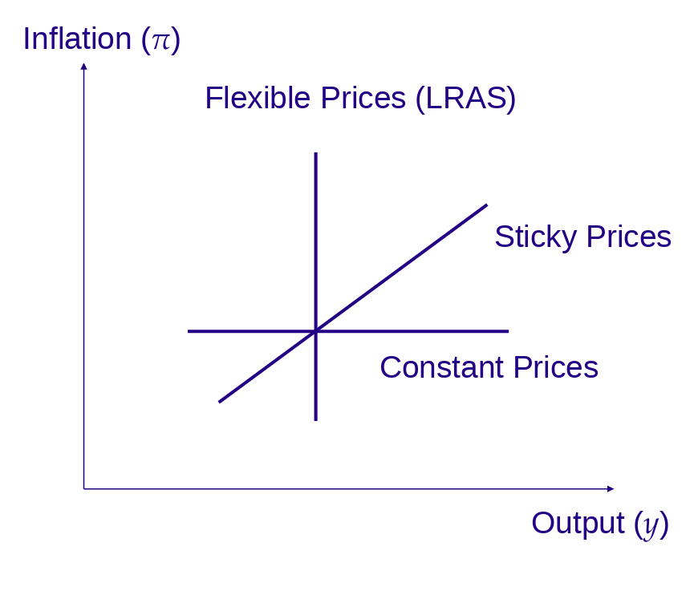
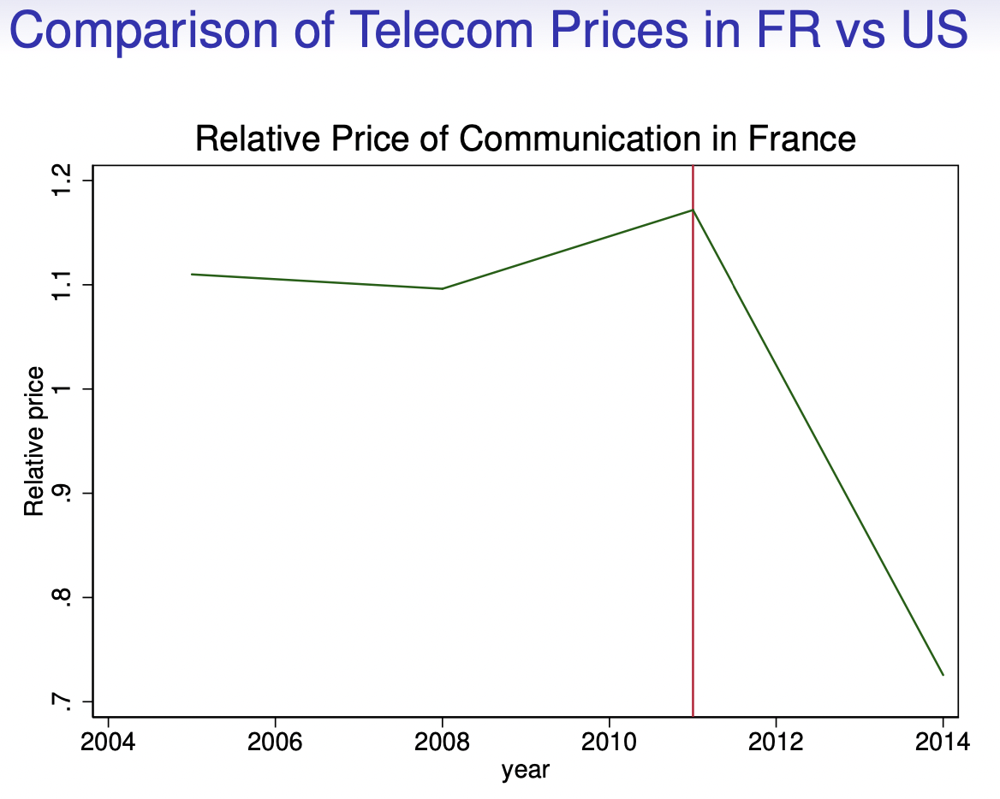
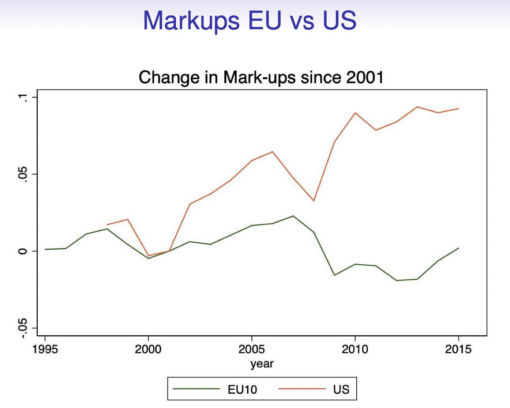
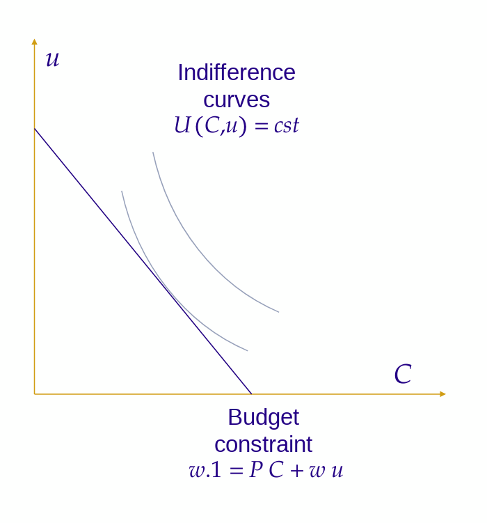
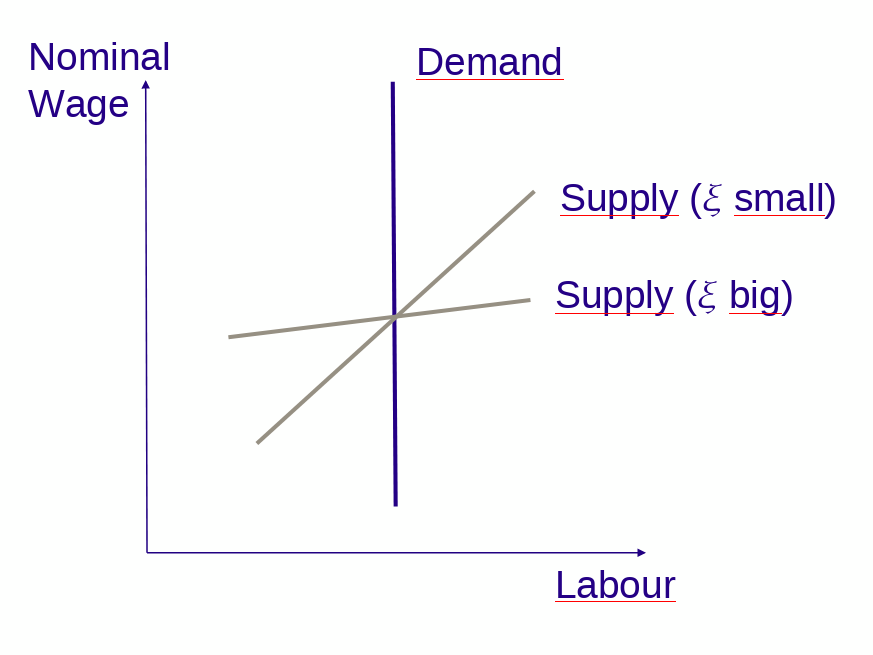
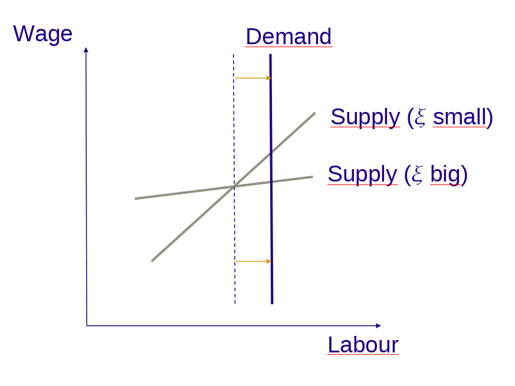
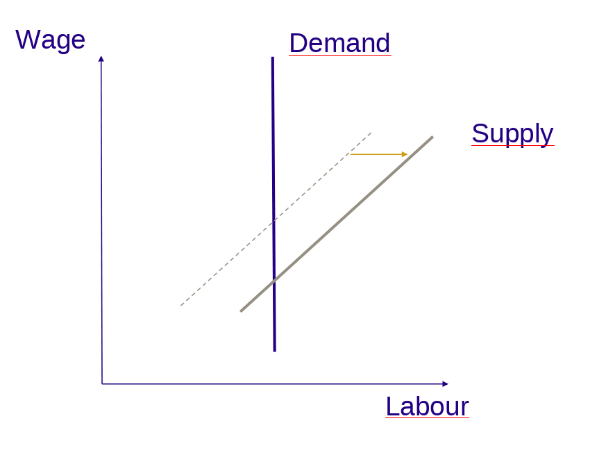
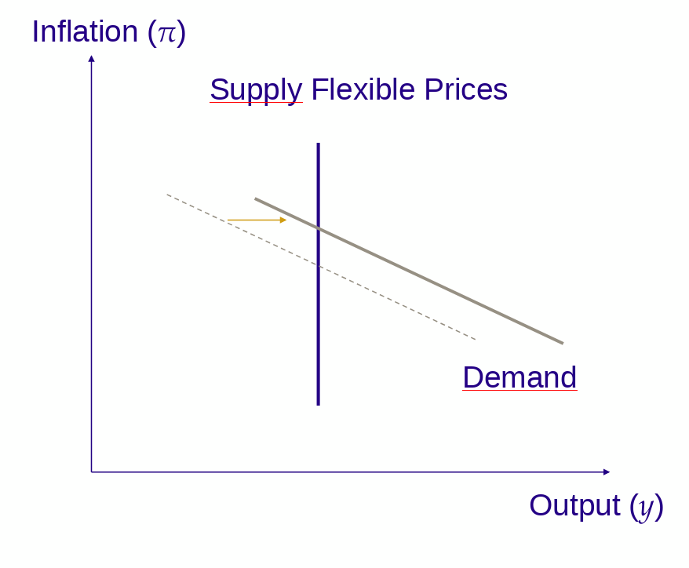
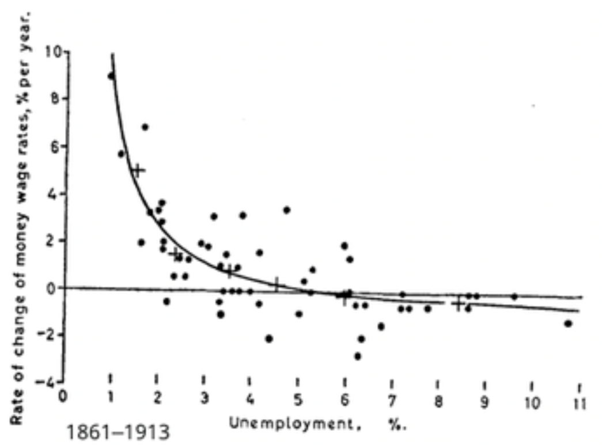
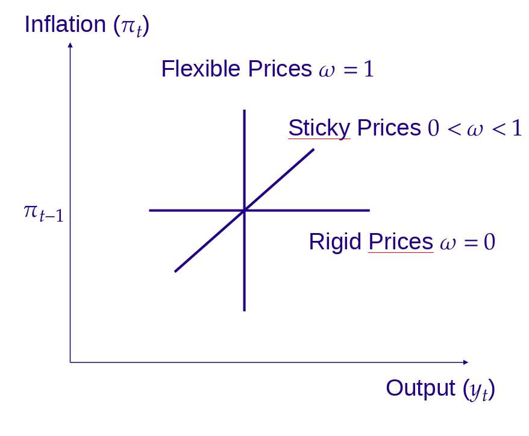

# Introduction

## Offre Agrégée

::: columns

:::: column

### Programme des amphis

- Consommation
- Demande agrégée
- Offre agrégée (\*)
- Sources des fluctuations
- Politique monétaire
- Long terme:
  - ...

::::

:::: column

### Cette session

* OA: Court terme et long terme
* Comportement des firmes
  * concurrence monopolistique
  * fixation des prix optimaux
* Équilibre sur le marché du travail
  * demande de travail
  * offre agrégée: arbitrage consommation/travail
* Équilibre
  * Équilibre natural
  * Équilibre avec rigidité des prix
* Formulations alternative de la courbe OA

::::

:::

# OA: court terme et long terme

## Deux cas extrêmes (1)

\framesubtitle{ Prix parfaitement flexibles}

* Supposons que les prix soient parfaitement flexibles
* Les allocations dépendent seulement des prix *relatifs*
* Le *niveau* des prix n'est pas un concept pertinent
  * exemple de __dichotomie classique__
* L'inflation n'affecte pas la production
* L'offre est indépendante de la *demande* agrégée


## Deux cas extrêmes (2)

\framesubtitle{ Prix parfaitement fixés }

- Supposons que les prix soient fixés à $P$
- Supposons que les firmes fassent face à la demande $Y$
- Que font les firmes ? Deux solutions
  - On sort de l'équilibre : elle ne peuvent pas fournir $Y$ au prix $P$
  - Il y a un degré d'ajustement : les firmes ajustent leur demande de travail pour produire $Y$
- Remarque :
  - Le deuxième cas implique un déséquilibre initial sur le marché du travail (offre excédentaire)
  - Les prix fixes correspondent à un équilibre déterminé purement par la demande


## Deux cas extrêmes (3)

\framesubtitle{ Lequel est le bon? }

::: columns

:::: {.column width=40%}



::::

:::: {.column width=60%}

* Prix flexibles
  * C'est le cas classique
  * Pertinent à long terme (quand les prix ont le temps de s'ajuster)
  * Court d'offre de long terme (ou LRAS pour Long Run Aggregate Supply)
* Prix constant
  * Utile pour argument keynésien (basé sur la demande comme ISLM)
  * Une façon de  _penser_ le très court terme
* __Le vrai court terme__
  * IRL, quelque part entre deux:  _prix collants_ (_sticky_)
  * Inclus des élément des demande et d'offre
  * Comment peut-on modéliser un ajustement imparfait des prix ?


::::

:::

# Comportement des firme


## Structures de marché

\framesubtitle{Reminder}

Dans un cours de micro, on voit typiquement plusieurs modèles de structure de marché:

- Concurrence parfaite : chaque firme prend les prix comme donnés
- Monopole : une firme a un pouvoir de marché
- Duopole : chaque firme prend en compte les décisions d'une autre firme (Bertrand, Cournot, ...)
  - interactions stratégiques : vers la théorie des jeux

Il nous faudrait une structure entre concurrence parfaite et monopole: __concurrence monopolistique__.

<!-- cf requin, baleine et requin-baleine -->

## Comportement de fixation de prix

\framesubtitle{Pourquoi la concurrence parfaite ne convient pas?}

Il nous faut un modèle de fixation des prix optimaux, qui nous permette d'étudier ce qui se passe lorsqu'une firme n'ajuste pas immédiatement.

Pourquoi pas la __Concurrence Parfaite__?

- toutes les firmes fixent un prix égal au coût marginal $mc$
- le prix de vente $p=mc$ est indépendant de la demande
- la quantité produite par les firmes à leur coût marginal n'est pas une fonction du prix agrégé \footnote{Elle est fixée par la présence de rendement d'échelle décroissants, qui fixe la quantité de facteurs qui peuvent être utilisés à un coût marginal donné.}

Pas utile pour dériver la courbe OA. Ce serait un modèle de l'équilibre à long terme.

## Comportement de fixation de prix

\framesubtitle{Rappel sur les monopoles}

La dépendance de l'offre agrégée aux prix implique une forme de pouvoir de marché pour les firmes. 

Un cas classique en micro est le prix de __Monopole__:

- supposons qu'un monopole ait une demande élastique au prix $y(p)$ avec une fonction de production linéaire et un coût marginal $mc$
- il maximise le profit: $\max y(p) p - w y(p)$
- résultat: le monopole fixe $p=(1+\mu)mc$ où $\mu$ dépend de l'élasticité de la demande: ($\mu=\frac{1}{1+\frac{1}{\epsilon}}$)
- $\mu$ est un __mark-up__ sur le coût marginal de production

C'est mieux mais comment modéliser le fait que seuls certains prix s'ajustent, si on a un seul producteur et un seul prix ?

## Comportement de fixation de prix

\framesubtitle{Concurrence monopolistique}

La __Concurrence monopolistique__ est une structure de marché où :

- il y a $N$ producteurs qui n'interagissent pas directement (pas d'interaction stratégique)
- ils produisent des biens qui sont __imparfaitement substituts__ (i.e. les consommateurs veulent consommer un peu de chacun)
- en conséquence, chaque producteur possède un pouvoir de marché, puisqu'il peut augmenter légèrement les prix sans perdre tous ses clients
- ... il prend une marge (markup)  $\mu$ sur les coût de production comme un monopole: $p=(1+\mu)mc$
- ... mais le markup dépend (négativement) du degré d'indifférence des consommateurs à consommer un bien plutôt qu'un autre et (négativement) de l'intensité de la concurrence (le nombre de firmes)


## Comportement de fixation de prix : concurrence monopolistique

\framesubtitle{Markups}

Les markups sont une mesure de la compétitivité des secteurs industriels.\footnote{Source: Christopoulou and Vermeulen (2010)}

|  | Industrie manufacturière | Services |
| :-: | :-: | :-: |
| United States | 28% | 36% |
| Euro Area | 18% | 56% |
| France | 15% | 26% |
| Germany | 16% | 54% |
| Italy | 23% | 87% |

Note: ce n'est pas la seule mesure de la compétitivité. Par exemple une industrie peut avoir des markups très faibles, mais des coûts excessifs, dus au manque de concurrence.


## Markups: EU vs. US

\framesubtitle{Markups: la situation change rapidement...}

Par Thomas Philippon,  _The Great Reversal. How America Gave up on Free Markets_, 2019

<!-- {width=40%}
{width=40%} -->

\begin{center}
\includegraphics[width=0.45\textwidth]{img/session_30.png}
\includegraphics[width=0.45\textwidth]{img/session_31.png}
\end{center}

# Concurrence monopolistique


## Comportement de fixation des prix

\framesubtitle{Prix optimal}

On suppose que chaque firme produit en utilisant seulement du travail, de sorte que le coût marginal est le salaire horaire $w_t$.

Supposons qu'une firme produise avec la technologie $Y_t = (1+z_t)L_t$

D'après cette formule, la production d'une unité utilise $\frac{1}{1+z_t}$ unités. Le coût marginal de produire une unité supplémentaire est $mc=\frac{w_t}{1+z_t}$.

En concurrence monopolisique la firme fixe un markup pour déterminer le prix optimal:

$$P^{\star}_t = (1+\mu)\frac{w_t}{1+z_t}$$

ou en logs

$$p^{\star}_t = \mu + w_t - z_t$$

## Comportement de fixation des prix

\framesubtitle{Déterminants du prix optimal}

Notre firme monopolistique fixe le prix: $$p^{\star}_t = \mu + w_t - z_t$$

Seule différence avec un monopole: on sait que $\mu$ dépend du nombre de compétiteurs.

Le prix optimal dépend de :

- Prix nominal: quand le salaire nominal augmente, les coûts marginaux augmentent et l'augmentation se répercute sur les prix (__pass-through__)
- Productivité: l'augmentation de la productivité baisse le coût marginal ce qui réduit le prix de vente optimal

# Marché du travail

## Marché du travail

Dans notre description rapide, nous avons vu que le prix optimal dépend du salaire horaire $w_t$.

Mais le salaire horaire est un résultat d'équilibre sur le marché du travail.
Pour comprendre la dynamique des prix, il faut donc regarder la dynamique du __marché du travail__ d'abord.

On va maintenant regarder en fonction du salaire horaire:

- la __demande de travail__ (de combien de travailleurs la firme a besoin pour atteindre un certain niveau de production)
- l'__offre de travail__ (combien d'heures les travailleurs sont prêts à offrir)


## Marché du travail

\framesubtitle{Fonction de production}

Rappelons la fonction de production des firmes:
$$Y_t = Z_t L_t$$
où $Z_t =(1+z_t)$ est un choc de productivité.

Soit en logs:
$$y_t = z_t - l_t$$

Cette relation produit directement la demande de travail venant des firmes:
$$l^D_t = z_t - y_t$$

La demande de travail correspond à la question "de combien de travailleurs les firmes ont besoin pour produire un montant donné"

## Marché du travail

\framesubtitle{Demande de travail}

Regardons l'offre de travail:
$$l^D_t = y_t - z_t$$

- La demande de travail est plus grande quand la production est plus grande
  - il faut plus de travailleurs pour produire plus
- La demande de travail est plus faible quand la productivité est plus haute
  - la technologie permet à chaque travailleur de produire plus -> il faut moins de travailleurs


# Marché du travail: offre de travail agrégée

## Marché du travail

\framesubtitle{Determinants de l'offre de travail}

* Quelle quantité de travail, les ménages sont-ils prêts à fournir?
* Clairement plus grande quand le salaire est plus élevé. Mais parle-t-on du salaire réel ou nominal ?
  * On a vu que le stravailleurs prennent des décisions d'allocations intertemporelles
  * Ce qui implique qu'ils utilisent les taux réels pour déterminer leur décisions d'épargne
  * \.\.\. Et leur salaire réel pour déterminer combien ils veulent travailler.
* Plus basse quand la consommation est plus haute
  * Car consommation et travail sont substituts
  * (ou la consommation et temps libre complémentaires)

<!-- Labour Supply -->

## Marché du travail

\framesubtitle{Offre de travail d'un agent}

::: columns

:::: {.column width=40%}



::::

:::: {.column width=60%}

```{=beamer}
\begin{overprint}
```

\onslide<1>

L'offre de travail peut-être microfondée on spécifiant les *préférences* des travailleurs. Prenons un travailleur qui peut choisir son offre de travail $L\leq1$. Il choisit entre

- consommer le panier de biens $C$ au prix $P$
- profiter du temps libre $U=1-L$

\onslide<2>

On peut écrire la contrainte de budget: $$W . 1 \geq P C + W U$$

Une fonction d'utilité commune est $$V(C,U) = \log(C) + \frac{U^{1-\gamma}}{1-\gamma}$$.

C'est un problème d'optimisation classique: optimiser l'utilité sous contrainte de budget.\footnote{On obtient la condition $\frac{\frac{1}{C}}{P}=\frac{U^{-\gamma}}{W}$}

```{=beamer}
\end{overprint}
```
::::

:::

## Offre de travail optimale

*[Cette slide a été rajoutée pour harmoniser les notations avec le poly. Elle est facultative est vise juste à établir la formule de la slide suivante. Notamment pourquoi la productivité apparait dans la formule.]*

Avec les notations du poly (voir appendice), chaque ménage $i$ choisit $C$ et $L_i$ pour maximiser $\log(C) - \xi L_i^{\frac{1}{\xi}}$ sous contrainte de budget $L_i W = P C$.

On obtient à l'optimum $(L^i_t)^{\frac{1}{\xi}-1} = \frac{W_t}{P_t} \frac{1}{C^i_t}$

En logs, $(\frac{1}{\xi}-1) l^i_{t} = w_t - p_t - c^i_t$

Autour d'un équilibre symmétrique (où tous les agents consomment et travaillent dans les mêmes quantité) on peut agréger cett relation pour obtenir  $(\frac{1}{\xi}-1) l_t = w_t - p_t - c_t$. Il reste ensuite à utiliser l'équilibre sur le marché des biens ($c_t = y_t$) et la fonction de production $y_t = l_t + z_t$ pour obtenir le résultat voulu.

## Marché du travail

\framesubtitle{ Offre de travail agrégée}

On admet que l'offre agrégée est donnée par $$l^S_t = \xi (w_t - p_t - z_t)$$

où $\xi$ est l'élasticité de l'offre de travail au salaire

L'offre de travail est déterminée par:

- le salaire réel $w_t - p_t$
  - l'augmentation des salaires nominaux augmente l'offre de travail (effet de richesse positif)
  - l'augmentation des prix nominaux décroit l'offre de travail (effet de richesse négatif)
- la productivité $z_t$
  - une productivité plus élevée, implique une consommation plus élevée car la production totale est plus élevée, ce qui réduit le désir de travailler (effet de substitution)

Note: lorsque le travail et la consommation sont plus substituables ($\xi$ plus élevé), l'offre de travail est plus élastique au salaire réel.


# Équilibre sur le marché du travail

## Marché du travail

::: columns


:::: column



::::

:::: column

\framesubtitle{Equilibrium}

On a obtenu les équations suivantes:

- Demande de travail: $l^D_t = y_t - z_t$
- Offre de travail: $l^s_t = \xi (w_t - p_t - z_t)$

A l'équilibre, $$l^D_t = l^S_t$$ ce qui produit $$w_t - p_t = \frac{y_t - (1-\xi)z_t}{\xi}$$

::::

:::

## Marché du travail

\framesubtitle{Équilibre: choc de demande}

::: columns

:::: column



::::

:::: column

__Graphiquement__:

- Lorsque les firmes nécessitent plus de travailleurs (parce que la production est plus élevée ou la productivité plus basse) la courbe de demande se déplace vers la droite.
- En conséquence, le nombre d'heures d'équilibre et le nombre de travailleurs, augmentent.
- Le salaire augmente et ce d'autant plus que l'offre de travail est peu élastique au salaire.

::::

:::

## Marché du travail

\framesubtitle{Équilibre: choc d'offre}

::: columns

:::: column



::::

:::: column

__Graphiquement__:

Lorsque l'offre de travail augmente (parce que le salaire réel est plus élevé ou la productivité et la consommation plus basses), puisque la demande est parfaitement inélastique, l'emploi d'équilibre ne change pas mais les salaires chutent.

::::

:::

# Equilibre: Équilibre Naturel


## Équilibre Naturel

\framesubtitle{Équilibre avec prix parfaitement flexibles}

On a vu pour l'instant:

- Les firmes en concurrence monopolistique fixent un markup sur le coût de production (coût du travail)
$$p^{\star}_t = \mu + w_t - z_t$$
- L'équilibre sur le marché du travail lie ce coût au niveau général des prix $p_t$ (ou prix agrégés)
$$w_t - p_t = \frac{(y_t - (1-\xi)z_t)}{\xi}$$

Lorsque tous les prix sont parfaitement flexibles, toutes les firmes peuvent ajuster et fixent le même prix (elles sont identiques). Donc $p^{\star}=p_t$. On obtient alors le niveau de production naturel: $$y^{nt}_t=z_t - \xi\mu$$

Le __PIB potentiel__ (ou __naturel__) est défini comme *le niveau de production qui serait atteint si les prix étaient parfaitement flexibles*.


## Équilibre Naturel

\framesubtitle{Commentaires: production}

Observons la formule pour le PIB naturel: $$y^{nt}_t = z_t - \xi \mu$$

- Un choc de productivité positif $z_t$ augmente le niveau naturel $y^{nt}_t$
- L'imperfection de la concurrence est néfaste à la production agrégée
  - En concurrence imparfaite ($\mu>0$), la production est plus faible qu'avec la concurrence parfaite ($\mu=0$)
  - intuition: chaque firme est en situation de monopole partiel et sa stratégie optimale consiste à rationner les marchés pour augmenter les prix et ses profits
- La dichotomie classique fonctionne: le niveau de production naturel dépend uniquement de variables réels ($z_t$ et $\mu$ et  non pas des variables nominales (ni le salaire $w_t$, ni le niveau des prix $p_t$, ...)


## PIB naturel

::: columns

:::: column



::::

:::: column

D'après la formule $$y^{nt} = z_t - \xi \mu$$
avec des prix flexibles, l'offre agrégée est une courbe verticale.

Parce qu'elle suppose que tous les prix relatifs et facteurs ont eu le temps de l'ajuster on l'appelle la courbe d'offre de long terme (__Long Run Aggregate Supply (LRAS)__. Notons que dans cette définition, *elle peut réagir à des chocs de productivité de court terme*.

Le graphe montre qu'augmenter la demande conduit seulement à une augmentation de l'inflation sans effet sur les quantités.

::::

:::

## Équilibre Naturel

\framesubtitle{Comments: emploi naturel}

En utilisant la formule pour la production $y^{nt} = z_t + l_t$ et en la combinant avec la production naturelle $y^{nt}_t = z_t -  \xi \mu$ on obtient le taux naturel d'emploi: $$l^{nt}_t= - \xi \mu$$

- De nouveau, l'imperfection de la concurrence a un impact négatif sur l'emploi
  - d'autant plus si l'élasticité de l'offre de travail est élevée
- Encore une manifestation de la dichotomie classique...
- Surprise: le taux d'emploi naturel ne dépend pas de la productivité
  - parce que la productivité affecte en même temps l'offre et la demande de travail et ce d'une faćon symmétrique
  - ce n'est pas généralisable: cela vient des hypothèses particulières du modèle

# Équilibre avec rigidité des prix

## Prix collants


Lorsque les prix sont parfaitement flexibles, ils s'ajustent de sorte que les quantités réelles s'ajustent immédiatement à leur niveau optimal.

Lorsque les prix sont collants (sticky)

- Les prix ne s'ajustent pas totalement aux chocs économiques de sorte que des quantités réelles (production, emploi), doivent fournir le degré d'ajustement manquant et réagissent trop
- Ceci est vrai même lorsque les chocs sont *nominaux* (par exemple un choc sur le taux d'intérêt réel)

Hypothèse centrale des modèle Néo-Keynésiens: des rigidités _nominales_  on des effets _réels_
On donne une justification basée sur les prix collants mais il y a d'autres possibilités (commes les salaires collants...)

## Prix collants

\framesubtitle{Les prix sont-ils vraiment collants?}

- Si les prix étaient flexibles il changeraient tout le temps
  - les prix des actions sont mis à jours en continu (LSE: en moyenne tous les 126 micro-secondes)
- On dispose de statistiques sur les changements des prix (ils sont bien collants: cf table)
  - Fréquence mensuelle de changements de prix: proportion de tous les prix qui change chaque mois
  - Durée moyenne des prix: temps moyen avant qu'un prix soit révisé

|  | Euro area (1996-2000) | United States (1998-200) |
| :-: | :-: | :-: |
| Monthly frequency of prices changes | 15.1% | 21.5% |
| Mean price duration | 13.0 months | 9.6 months |

## Fixation des prix avec prix collants (1)

\framesubtitle{Concurrence monopolistique avec prix collants.}

On modélise les prix collants en supposant que certains prix ne peuvent pas s'ajuster.

Plus précisément on considère un modèle de concurrence monopolistique où:

- une fraction $\omega$  des firmes ajuste ses prix à la date $t$ en fonction des conditions économiques de la date $t$
- une fraction $(1-\omega)$ ajuste ses prix sur la base des ses anticipations d'inflation en $t-1$, et ne les change pas à la date $t$

Si l'on attend assez longtemps tous les prix ont pu s'ajuster et la production revient à son niveau naturel.

Mais si la demande ou les conditions économiques changent en $t$, seule une fraction $\omega$ des firmes réagi, de sorte que l'économie dévie de son niveau naturel.


## Fixation des prix avec prix collants (2)

Parce que certaines firmes ajustent mais pas toute, il y a une dispersion des prix.

On doit faire attention à distinguer:

- l'index des prix $p_t$
- le prix fixé par les firmes qui optimisent: $p^{\star}_t$ qui peut différer de l'index des prix
- le prix fixé à l'avance par les firmes qui n'optimisent pas $p^0_t$
L'index des prix est une moyenne de tous les prix $$p_t = \omega p^{\star}_t + (1-\omega) p^0_t$$

Notre but ultime est d'obtenir des formules impliquant uniquement les prix agrégées et l'inflation.

## Fixation des prix avec prix collants (3)

Dans la section sur la concurrence monopolistique on a vu que le prix optimal vaut :
$$p^{\star}=\mu + w_t - z_t$$

Et par l'équilibre du marché du travail : $$w_t - p_t = \frac{y_t - (1-\xi)z_t}{\xi}$$

La combinaison des deux donne :

$$p^{\star}_t = \mu + p_t + \frac{y_t - z_t}{\xi}$$

## Fixation des prix avec prix collants (1)

La formule pour la fixation des prix $$p^{\star}_t  = \mu + p_t + \frac{y_t - z_t}{\xi}$$ a un sens intuitif:

- puisque le prix agrégé détermine le coût de production (à travers le coût du travail), *une augmentation du prix agrégé augmente le prix fixé par une firme en concurrence monopolistique*.
- lorsque la production augmente, le revenu augmente ce qui réduit l'offre de travail et tend à augmenter le coût du travail. Cela augmente aussi le prix fixé par les firmes.
- A l'inverse, lorsque la productivité augmente, la demande de travail est réduite, ce qui réduit le coût de la production donc le prix fixé par la firme.

## Fixation des prix par les firmes qui n'ajustent pas

\framesubtitle{Fixation de prix échelonnée}


```{=beamer}
\begin{small}
```
Les firmes qui n'ajustent pas aimeraient fixer le prix $p^{\star}_t = \mu + p_t + \frac{y_t-z_t}{\xi}$ mais puisqu'elles ne peuvent pas ajuster dans la période $t$, elles fixent un prix une période en avance, sur la base des anticipations qu'elles ont à l'époque:

$$p^0_t = \mu + E_{t-1}p_t + \frac{E_{t-1}y_t - E_{t-1}z_t}{\xi}$$

Par souci de simplicité on fait les hypothèses additionnelles suivantes sur la *formation des anticipations* :

- les prévisions de prix sont basées sur les prix passés et l'inflation passée: $E_{t-1} p_t = p_{t-1} + \pi_{t-1}$
- pour fixer les prix, les firmes supposent que la production est revenue à son niveau naturel: $E_{t-1} y_t = y_t^{nt}$

On obtient le prix suivant pour les firmes qui n'ajustent pas: $$p_t = \mu + p_{t-1} + \pi_{t-1}$$

```{=beamer}
\end{small}
```


## Fixation des prix par les firmes qui n'ajustent pas

\framesubtitle{Accélération de l'inflation}

Maintentant, calculons le nouveau prix agrégé comme la moyenne des prix fixés par les deux types de firmes: 
$$p_t = (1-\omega) (p_{t-1}+\pi_{t-1}) + \omega p^{\star}_t$$

Cette équation peut être réécrite comme: $$p_t = p_{t-1} + \pi_{t-1} + \frac{\omega}{1-\omega} (p_t^{\star}-p_t)$$

Ou $$\pi_t = \pi_{t-1} + \frac{\omega}{1-\omega} (p^{\star}_t-p_t)$$


## Offre agrégéé

Après quelques calculs (en utilisant l'équilibre du marché du travail et la définition du niveau de production naturel) on obtient $$\pi_t = \pi_{t-1} + \kappa (y_t - y^{nt})$$ où $\kappa=\frac{\omega}{\xi(1-\omega)}$. Cette relation est notre courbe d'*Offre Agrégée*.

Cette équation introduit un arbitrage de court terme entre inflation et production: lorsque les prix augmentent, les firmes produisent plus.

C'est l'équivalent théorique de la courbe de Philips.


## Courbe de Philips (William Phillips, 1958)

::: columns

:::: column



::::

:::: column

A l'origine, la courbe de Philips était formulée comme un arbitrage entre inflation et chômage.

Mais le chômage est clairement lié au travail et le travail à la production.

Avec nos notations, on peut écrire:

- $u_t = \overline{1}-l_t$
- $l^D_t = y_t - z_t$
- puis $y_t = 1-u_t + z_t$

A l'aide de la courbe d'offre et de la valeur de taux de chômage naturel, on obtient un version plus traditionnelle de la courbe de Philips:

$$\pi_t = \pi_{t-1} - \kappa (u_t - u^n_t)$$

::::

:::

# Ajustement des prix

::: columns

:::: column



::::

:::: column

Notre formule pour l'offre agrégée: $$\pi_t = \pi_{t-1} + \kappa (y_t - y^n_t)$$ avec $\kappa = \frac{\omega}{\xi (1-\omega)}$ est assez flexible.

Elle peut décrire plusieurs situations.

- lorsqu'aucune firme n'ajuste ($\omega = 0$) et alors $\pi_t = \pi_{t-1}$ la courbe d'offre est horizontale à court terme ($\pi_{t-1}$ est fixe)
- lorsque toutes les firmes ajustent ($\omega=1$) alors $y_t = y_t^{nt}$, la courbe d'offre est verticale
- entre les deux, on a une courbe OA croissante

::::

:::


# Explications alternatives


## Explications alternatives

Il y a plusieurs façons d'expliquer pourquoi la courbe d'offre agrégée est croissante:

- Prix collants
- Salaires collants
- Perception erronée

Essayons de contruire informellement des intuitions.

## Prix collants

Supposons que les prix soient initialement à leur niveau de long terme anticipé (on raisonne comme si l'inflation d'équilibre était zero):

- Prenons un choc qui crée une pression inflationniste (par exemple une baisse du taux d'intérêt par la C.B.) pressure (for instance the CB lowers interest rates)
- Les prix devraient augmenter.
- Mais les prix ne peuvent pas augmenter leurs prix.
- Alors au lieu de les augmenter, elle produisent plus...
- En embauchant plus de travailleurs.
- La production augmente, le chômage diminue.

On a vu dans les slides précédentes qu'on peut donner un sens rigoureux à cette série d'événements.

## Salaires collants

On suppose maintenant que les salaires, ne peuvent pas facilement être renégociés à court terme. Considérons la suite d'événements suivants:

- Un choc crée une pression inflationniste (ex: CB baisse les taux)
- Les prix tendent à augmenter
- Comme les salaires réels baissent les travailleurs demandent qu'on les réévalue
- Mais les contrats ne sont pas facilement réévalués...
- et le coût du travail reste plus bas pour les firmes...
- qui produisent plus et augmentent l'emploi

## Perception erronée

On suppose ici que les producteurs n'observent que les prix de leur propre industrie. Ils ne réalisent pas que ces prix sont indicés sur les prix agrégés. Voici l'histoire:

- Un choc crée une pression inflationniste (par ex, la CB baisse les taux)
- Les prix tendent à augmenter
- Les producteurs d'une industrie donnée observent que les prix augmentent dans leur secteur
- il croient (à tort) que leur industrie est plus rentable que les autres
- ils décident de produire plus en embauchant plus

# Conclusion

## A retenir

- les modèles néokeynésiens nécessitent une courbe d'offre agrégée croissante (plutôt que verticale)
  * c'est nécessaire pour l'efficacité des politiques publiques
* les prix sont collants: cette rigidité nominale a des effets réels et implique que le niveau d'inflation affecte la production
* on l'a montré dans un modèle avec
  * concurrence monopolistique
  * fixation des prix échelonnée (seule une fraction des firmes ajuste à chaque période)
  * marché du travail sans friction, avec des décisions de travailler microfondées
