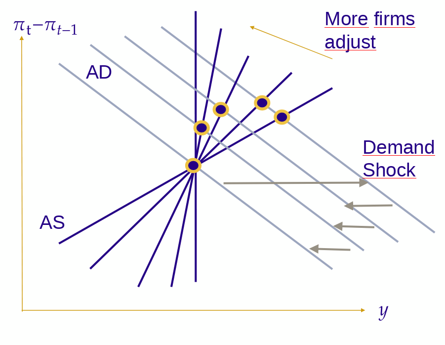

## Introduction

::: columns

:::: column

### Programme des amphis

- Consommation
- Demande agrégée
- Offre agrégée
- Sources des fluctuations (*)
- Politique monétaire
- Long terme:
  - ...

::::

:::: column

### Cette session

Les sources des fluctuations:

- L'équilibre
- Choc de demande agrégée
  - le court terme
  - la dynamique
- Choc d'offre

Cette sessions récapitule les deux sessions précédentes. Assurez-vous de bien comprendre l'approche générale et de développer les intuitions.

::::

:::

## Équilibre OA/DA

Rappelons notre modèle:

- Demande Agrégée: $$y_t = \theta_t - \sigma \gamma (\pi_t - \overline{\pi})$$
  - __mécanisme__: *les presssions in‡ationnistes ($\pi_t>\overline{\pi}$) poussent la
banque centrale à adopter une politique monétaire restrictive, ce qui réduit la demande et la production (et inversement)*
- Offre Agrégée: $$\pi_t = \pi_{t-1} + \kappa (y_t - y^t_n)$$
  - __mécanisme__: *un écart de production élevé engendre des tensions sur
le marché du travail qui élèvent le salaire réel d’équilibre ; les
entreprises qui le peuvent répercutent ce coût en élevant leur prix*

## Équilibre de long terme

- À long terme, tous les prix ont été ajustés de manière optimale et l'économie se comporte comme une économie de prix flexibles (OA): $$y_{\infty} = y_{\infty}^n = z_{\infty} - \mu^{\star}$$
- Par ailleurs, en supposant qu'à long terme $\pi_{\infty} = \overline{\pi}$, on a: $$\theta_{\infty} = y_{\infty}$$ (c'est "l'offre qui détermine la demande)
- Dans notre étude des chocs à la date $t$, on suppose que l'économie était à l'équilibre de long terme en $t-1$

## Équilibre de court terme

$$\text{\textbf{DA}}: y_t = \theta_t - \sigma \gamma (\pi_t - \overline{\pi})$$
$$\text{\textbf{OA}}: \pi_t = \pi_{t-1} + \kappa (y_t - y^t_n)$$

Dans ce modèle il y a:

- deux variables __endogènes__: $y_t$ et $\pi_t$
- deux variables __exogènes__: $\theta_t$ et $y^{n}_t$
- une variable __prédéterminée__: $\pi_{t-1}$


## Équilibre de court terme

Étant donnée l'inflation passée $\pi_{t-1}$ et la cible d'inflation ($\overline{\pi}$) on peut trouver la paire (inflation $\pi_t$ / output $y_t$) qui correspond aux chocs ($\theta_t$, $y^n_t$ ).

$$y_t = constant + \left(\frac{1}{1+\sigma\gamma\kappa}\right) \theta_t + \left( \frac{\sigma \gamma \kappa}{1+\sigma \gamma \kappa} \right) y^n_t$$

$$\pi_t = constant + \left(\frac{\kappa}{1+\sigma\gamma\kappa}\right) \theta_t - \left(\frac{\kappa}{1+\sigma \gamma \kappa}\right) y^n_t$$

Les termes entre parenthèse sont génériquement appelés "multiplicateurs".
Ils ont bien le signe attendu.
Voyons comment on peut interpréter leur effet.

## Choc de demande


Que représente $d \theta_t$ ? Qu'est-ce qui peut cause un déplacement négatif de la courbe de demande ?

- Un changement dans les préférences des consommateurs (désir de consommer)
- Un changement dans les anticipations des firmes et des consommateurs concernant leur revenus futurs.
- Une augmentation de l'incertitude dans les prévisions agents économiques (consommateurs, firmes)
- Une évolution des des exportations nette (changement dans la demande pour les biens domestiques, fluctuations dans le taux de change)
- / Ou des mouvements de capitaux internationaux
- Un changement dans la politique de la banque centrale
- Un changement dans le niveau de dépenses du gouvernement


## Choc de demande

::: columns

:::: column


::::

:::: column

```{=beamer}
\begin{overprint}
```

\onslide<1>

Un choc $d \theta_t$ sur la demande agrégée

- Augmente la production de $$d y_t = \left( \frac{1}{1+\sigma \gamma \kappa} \right) d \theta_t$$
- Augmente l'inflation de $$d \pi_t =\left( \frac{\kappa}{1+ \sigma \gamma \kappa} \right) d \theta_t$$

\onslide<2>

Les paramètres principaux sont:

- $\sigma$: la décision d'épargne investissement par les agents économiques (consommateurs et firmes)
- $\gamma$: la réaction de la banque centrale
- $\kappa$: la vitesse à laquelle les firmes ajustent leurs prix
  - (plus élevé lorsque plus de firmes ajustent)

Peut-on raconter intuitivement ce qui se passe en utilisant tous les mécanismes que l'on a vu jusqu'a présent?

```{=beamer}
\end{overprint}
```

::::

:::

## Choc de demande

\framesubtitle{Impact théorique: court terme}

Peut-on raconter intuitivement ce qui se passe en utilisant tous les mécanismes que l'on a vu jusqu'a présent ?

- Une augmentation de la demande agrégée pour les biens et les services
- Augmente la production
- Ce qui augmente la demande de travail
- Ce qui augmente les salaires réels (car l'offre de travail n'est pas parfaitement élastique)
- Ce qui augmente les coûts de production
- Ce qui augmente les prix de vente
  - mais pas 1 pour 1 car certaines firmes ne peuvent pas ajuster leur prix
- L'inflation des prix décourage la demande ce qui compense partiellement pour l'augmentation de la production.

## Choc de demande

\framesubtitle{Impact Théorique : dynamique}

::: columns

:::: column

```{=beamer}
\begin{overprint}
```

\onslide<1>


\onslide<2->



```{=beamer}
\end{overprint}
```

::::

:::: column

```{=beamer}
\begin{overprint}
```

\onslide<1>

Considérons un choc de demande transitoire

- Qui dure un certain nombre de périodes avant de disparaître
- Les conclusions dépendent du degré de __persistence__

Lorsque plus de firmes ont eu le temps d'ajuster, la pente de la courbe AS augmente (elle est donnée par $\kappa=\frac{\omega}{\xi(1-\omega)}$ où $\omega$ est le nombre de firmes qui ont ajusté)

\onslide<2>

On peut décrire la __dynamique de l'inflation__ informellement comme suit:

- L'inflation augmente initialement à cause du choc de demande
- L'augmentation de l'inflation continue alors que la fraction des firmes qui ajustent augmente (rotation de la courbe AS)
- L'inflation revient à la normale quand le choc de demande s'arrête
- Plus les prix s'ajustent vite, plus l'nflation augmente

\onslide<3>

Et pour la dynamique de la production ?

- Elle augmente initialement avec la demande
- Puis revient à la normale alors que l'effet du choc de demande s'estompe
- Plus les prix s'ajustent vite, plus faible est l'effet sur la production

```{=beamer}
\end{overprint}
```

::::

:::

## Choc de demande: vérification empirique

::: columns

:::: {.column width=60%}

```{=beamer}
\begin{overprint}
```

\onslide<1>


Le graphe ci-contre\footnote{From: Nominal Rigidities and the Dynamic Effect of a Shock to Monetary Policy, Christiano, Eichenbaum and Evans, Journal of Political Economy, 2005}
 montre l'effet d'un choc de demande "pur": un choc de politique monétaire non-anticipé

Il compare la réponses de plusieurs variables économiques

- Dans les données (économétrie: estimation VAR)
- Dans un modèle avec des rigidités nominale (DSGE)
- Les deux ont un comportement similaire

\onslide<2>

Et par rapport à notre modèle?

- L'investissement et la consommation augmentent
- L'inflation augmente à moyen terme (pas juste à l'impact)
- Le salaire réel augmente
- L'augmentation de la production est persistante
  
  - ... mais il y a du capital qui lisse la production dans le temps
  

```{=beamer}
\end{overprint}
```

::::

:::: {.column width=40%}


::::

:::

## Choc d'Offre

\framesubtitle{Impact Théorique}

::: columns

:::: column


::::

:::: column


```{=beamer}
\begin{overprint}
```

\onslide<1>

Un choc $d y^{nt}_t$ sur l'offre agrégée

- Augmente la production de: $$d y_t = \left( \frac{\sigma \gamma \kappa}{1+\sigma \gamma \kappa} \right) d y^{nt}_t$$
- Augmente l'inflation de: $$d \pi_t = \left( \frac{\kappa}{1+\sigma \gamma \kappa} \right) d y^{nt}_t$$

\onslide<2>

Les paramètres sont les mêmes qu'avant:

- $\gamma$: réaction de la banque centrale
- $\sigma$: décision d'épargne investissment par les consommateurs et les firmes
- $\kappa$: lié à la fixation des prix par les firmes


```{=beamer}
\end{overprint}
```

::::

:::

## Offre

Un choc d'offre est un choc sur le PIB naturel $d y^{nt}_t$.
Qu'est-ce qu'il représente ? Qu'est-ce qui cause un shift vers la gauche  ou la droite de la courbe d'offre ?

- Les changements qui affectent le long terme (il affecte le pib naturel)
- Des changements dans les facteurs de production
- Des chocs de productivités
- Dans changement dans les markups (ou la compétitivité)
- Des changemements dans les anticipations (qui affectent la fixation des prix par les firmes)


## Chocs d'offre

\framesubtitle{Politique de stabilisation}

::: columns

:::: column


::::

:::: column

```{=beamer}
\begin{overprint}
```

\onslide<1>

Un choc d'offre négatif déplace la courbe OA vers la gauche

- L'inflation augmente
- La production diminue

Comment le gouvernement et la BC peuvent-ils mitiger le choc ?

- Impossible d'agir sur l'offre

\onslide<2>

Dans notre modèle la __banque centrale__ est déjà incluse dans la courbe DA

- Ce qui rend la demande plus réactive à l'inflation (plus horizontale)
- Mais la règle MP suppose que la BC ne regarde que l'inflation
- ... ce qui est un mauvais cadre pour étudier la réponse de la BC

\onslide<3>

Le __gouvernement__ peut stimuler la demande pour contrer le choc d'offre

- Avec des politiques fiscales
- Mais ća ne fonctionne qu'à court terme
- ... et pose quelques questions(est-ce efficace ? d'où vient l'argent ?)

```{=beamer}
\end{overprint}
```


::::

:::

## A retenir

- Dans notre modèle, à court terme:

  - Un choc de demande positif implique que l'inflation et la production augmentent
  - Un choc d'offre positif implique une baisse de l'inflation et une augmentation de la production

- Après un choc de demande *persistant*

  - Alors que les prix s'ajustent l'augmentation initiale de la production s'inverse
  - Lorsque la demande revient à la nomale, l'inflation revient à son niveau naturel
  - IRL, les réaction de la production et de l'inflation ont aussi des lags

- Les politiques monétaires et fiscales pevent annuler les choc de demande à court terme
- Les chocs d'offre ne peuvent pas être directement annulés mais...

  - Les politiques de demandes peuvent les *accomoder* à court terme (jusqu'à ce que les prix s'ajustent)