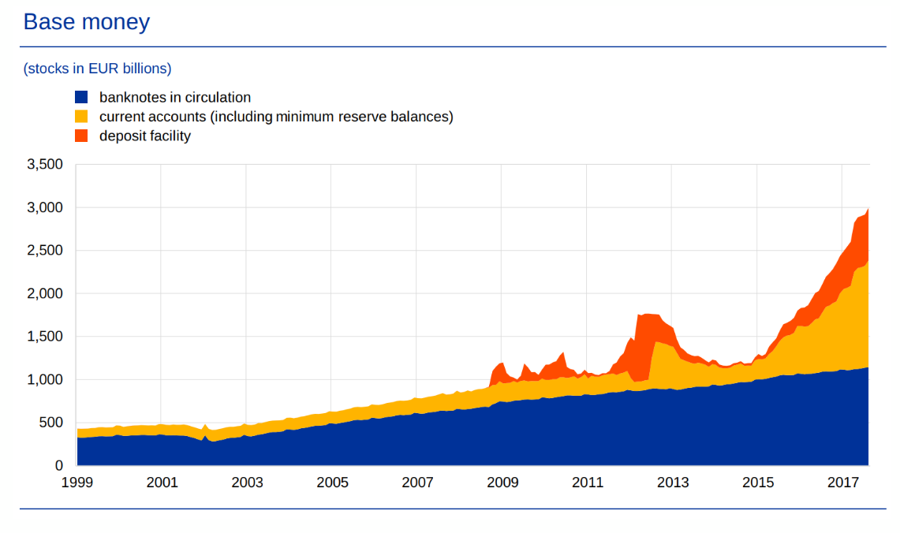
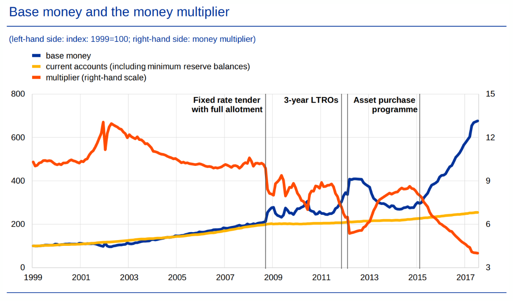
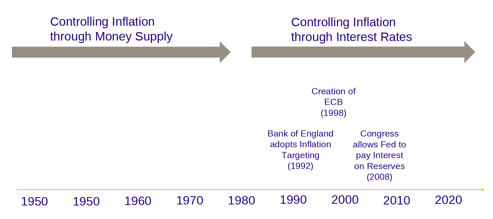
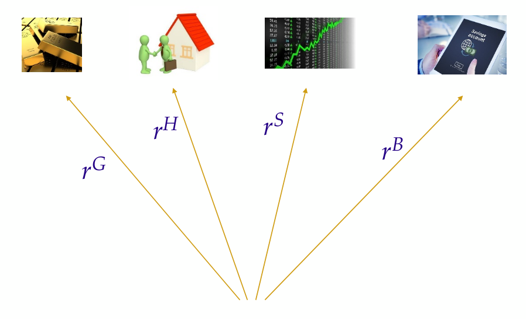
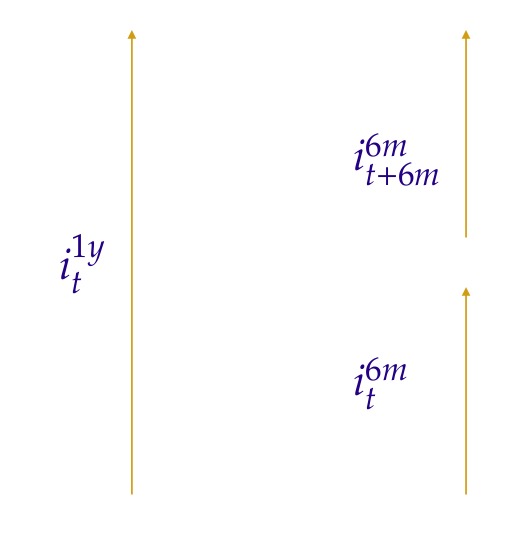
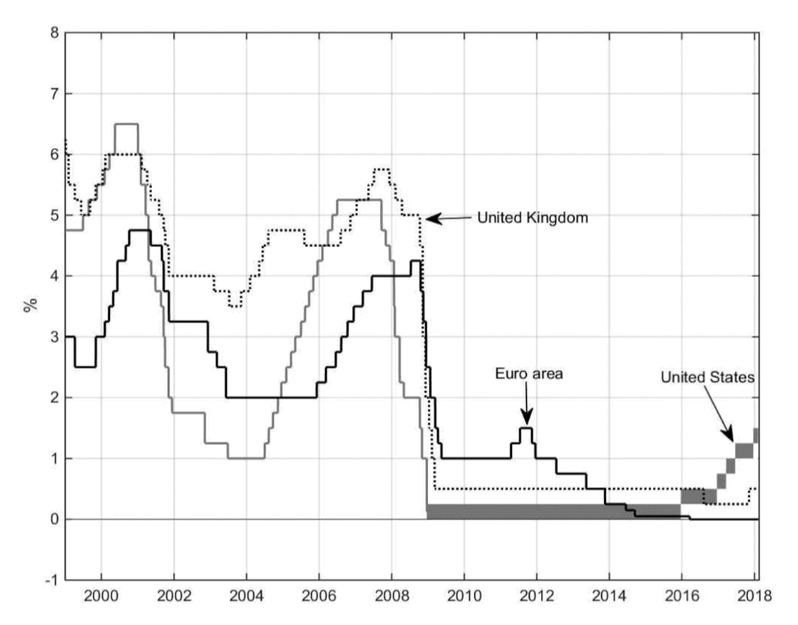
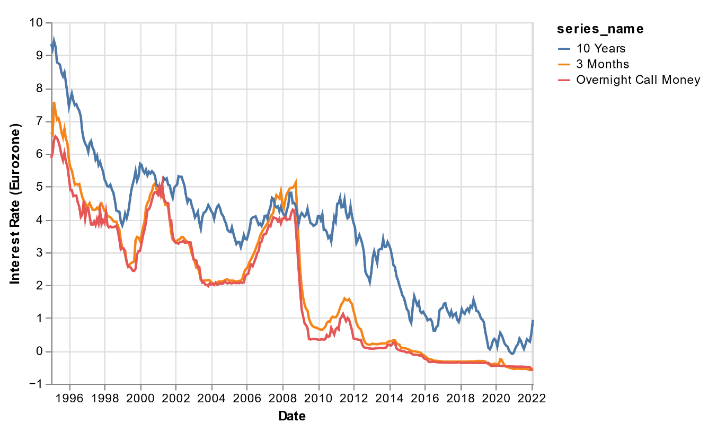

## Introduction

::: columns

:::: column

### Programme des amphis

- Consommation
- Demande agrégée
- Offre agrégée
- Sources des fluctuations
- Politique monétaire (*)
- Long terme:
  - ...

::::

:::: column

### Cette session

- Les outils de la politique monétaire
- Implémentation de la politique monétaire
  - La structure des taux d'intérêt
  - Le marché interbancaire

::::

:::

## Les outils de la politique monétaire

## Les outils de la politique monétaire

Quels sont les principaux outils de la politique monétaire ?

- Opérations d'open market
  - la BC échange des liquidités (cash) en échange d'actifs moins liquides (obligations/bons du gvt)
  - la BC prête sur le marché interbancaire

- Taux de réserves obligatoires

- Taux d'intérêt sur les réserves détenues par les banques auprès de la BC
  - "Discount rate" aux US
  - "Main Refinancing Operations" (MRO) en Zone Euro

- D'autres outils non-conventionnels (non couverts ici)

## Masse Monétaire / Base Monétaire (1)

{height=50%}

Depuis la "Théorie Générale de l'Emploi, de l'intérêt et de la monnaie", de J.M.Keynes, on sait que la quantité de monnaie qui circule dans l'économie joue un rôle dans la détermination de prix et de l'inflation.

Qu'est-ce que la monnaie ?

## Masse Monétaire / Base Monétaire (2)

Qu'est-ce que la monnaie ? La BCE liste plusieurs agrégats monétaires:

- M1: devises (pièces, billets) en circulation et dépots au jour le jour
- M2: M1 + depôts dont la maturité est inférieure à deux ans + dépôts dont la maturité est supérieure à deux ans mais qui peuvent être liquidés avec un préavis de remboursement inférieur à trois mois
- M3: M2 + accords de rachat d'actions ("repurchase agreement"), parts/unités des "money market fund" et obligations dont la maturité est inférieure à deux ans.
- Les agrégats monétaires sont composés d'agrégats dont la *liquidité* est décroissante
  - M1 est la base monétaire
  - M2 est la presque monnaie ("quasi money")
  - M3 est la monnaie au sens large ("broad money")

## Contrôler M1

\framesubtitle{Le système de réserves fractionnaires}

- La banque centrale a le monopole de la création de la "monnaie banque centrale"
  - Pièces, billets, euros numériques
  - Pour l'injecter, elle l'échange contre des actifs moins liquides
- Notons que la base monétaire (M1) inclut les prêts faits par les banques et versés au compte de leurs clients dépositaires
  - Les banques privées créent de la monnaie ! (c'est un fait)
- Le crédit par les banques privées est limité par le __taux de réserves obligatoire__
  - Changer ce ratio devrait être un puissant outil de politique monétaire

## Contrôler M1

{width=45%} {width=45%}

- La base monétaire a beaucoup augmenté. Les crédits pas tellement.\footnote{Source: ECB}
- Le multiplicateur du crédit a décru et les ratio obligatoire ne sont pas contraignant (pour info, les ratios obligatoire valaient 2% jusqu'en 2012, 1% depuis)
- La banque centrale ne contrôle plus vraiment M3 (broad money) depuis la crise financière.

## Evolution des pratiques des banques centrales

## Ciblage d'inflation et règle de Taylor

La plupart des banques centrales pratiquent maintenant une forme de __ciblage d'inflation__.

- elle tentent de maintenir l'inflation autour d'une cible prédéfinie (e.g. 2\% en Zone Euro)

Pour atteindre la cible elles manipulent les taux d'intérêt *nominaux*:

- soit en contrôlant l'offre de monnaie
- soit en contrôlant les taux d'intérêt directement

John Taylor a découvert empiriqument que les décisions pour les taux d'intérêt étaient bien approximées par une __règle simple__:

$$i_t = i^{\star} + 0.5 (\pi_t - \pi^ {\star}) + 0.5 (y_t - y_t^ {nt})$$

## Règle de Taylor et taux effectif (1)

{width=80%}

##  Règle de Taylor et taux effectif (2)

{width=80%}

Source: Orphanides et Wieland

## Règle de Taylor

La règle de Taylor originale est trop simple.

Une version basée sur les anticipations d'inflation décrit encore mieux les decisions des CBs:

$$i_t = i^{\star} + \alpha_{\pi} (E_t \left[ \pi_{t+1} \right] - \pi^{\star}) + \alpha_y (y_t - y_t^ {nt})$$

Cette version est très utile pour comprendre les éléments de langage de la BC:

- elle décrit la conjoncture éco en terme d'__output gap__
- elle essaie d'__ancrer les anticipations__ en les gardant près d'une cible d'inflation

## Implémentation de la politique monétaire

## Équation de Fisher et anticipations d'inflation

\framesubtitle{Equation de Fisher}

Rappelons l'__équation de Fisher__ anticipée
$$r_t = i_t - \pi_{t+1}$$

Plus généralement (en environnement incertain) on devrait écrire.
$$r_t = i_t - E_t [\pi_{t+1}]$$

## Règle monétaire et anticipations d'inflation

Jusqu'à présent, on a écrit la règle monétaire (MP) de cette faćon: $$r_t = r^ {\star} + \gamma (\pi_t - \overline{\pi})$$

Or la BC ne contrôle pas les taux d'intérêt réels mais le taux *nominal*. Si l'on remplace MP dans l'équation de Fisher $r_t = i_t - \pi_{t+1}$ on obtient: $$i_t = r^{\star} + \gamma (\pi_t - \overline{\pi}) + \pi_{t+1}$$

On voit alors que la BC doit réagir à une combinaison de l'inflation et de l'inflation anticipée (ce qui ressemble à une règle de Taylor).

Comment la BC mesure et contrôle les anticipations d'inflations ? C'est une question aux ramifications très profondes (prophéties auto-réalisatrices, réputation et incohérence temporelle, ...)\footnote{Jedi Mind Trick: « These aren’t the droids you are looking for ». Matt O’Brian:  « Central Banks have a strong influence on market expectations »}

## Taux d'intérêt de court terme

En réalité la BC ne contrôle pas $i_t$ directement (le taux trimestriel ou annuel)

Elle contrôle le taux de très court terme, typiquement au jour le jour.  Où donc?

Sur les __marchés interbancaires__

- Les banques se prêtent les unes aux autres les réserves qu'elles détiennent sur le compte banque centrale
- Sur ce marché, la banque centrale est un "faiseur de prix"

Comment le fait de fixer les taux de court terme, affecte-t-il les taux d'intérêt à n'importe quel horizon?

- Par la capacité du marché (/des investisseurs) à *arbitrer* entre différentes options d'investissement

## Arbitrage

::: columns

:::: {.column width=40%}

::::

:::: {.column width=60%}

- La notion d'__arbitrage__ est un concept pervasif en finance et économie
- Lorsque deux (ou plusieurs) options d'investissement donnent différent retours sur investissement, les investisseurs se focalisent sur l'option la plus profitable... jusqu'à ce que les rendement s'égalisent.
- Donc à l'équilibre, toutes les opportunités d'invesissement équivalentes doivent avoir le même retour sur investissment (rendement)
- Les différences entre les rendements peuvent s'expliquer par
  - le profil de risque
  - la liquidité
  - ...

::::

:::

## Structure des échéances et taux d'intérêt

::: columns

:::: {.column width=40%}

::::

:::: {.column width=60%}

On peut appliquer le principe d'arbitrage à:

- Une obligation à un an au taux $i_t^{1y}$
- Deux obligations à 6 mois qui rapportent (en taux annualisés)

  - $i_t^{6m}$, achetée à la date $t$
  - $i_{t+6m}^{6m}$, achetée à la date  $t+6m$
- On a donc deux options d'investissement sur un an
- Quelle est la condition d'arbitrage ?

::::

:::

##  Structure des échéances et taux d'intérêt

Si l'on investit le montant $X$ à la date $t$

L'option 1 rapporte:

- $X(1+i^{1y})$ après un an
- Le rendement (brut) est $(1+i^{1y})$

L'option 2 rapporte: (attention au fait que les rendements sont annualisés)

- $X(1+i^{6m}_t)^{1/2}$ après 6 mois
- $X(1+i^{6m}_t)^{1/2}(1+i_{t+6m}^{6m})^{1/2}$ après un an
- Le rendement (brut) est $(1+i^{6m}_t)^{1/2}(1+i_{t+6m}^{6m})^{1/2}$

## Structure des échéances et taux d'intérêt

L'équation d'arbitrage se lit: $$(1+i^{1y}) = (1+i^{6m}_t)^{1/2}(1+i_{t+6m}^{6m})^{1/2}$$

Ou en logs: $i^{1y}_t = \frac{1}{2} i^{6m}_t + \frac{1}{2} i^{6m}_{t+6m}$

Sachant que les investisseurs sont averses aux risques et valorisent la flexibilité de pouvoir récupérer leur mise plus tôt, il demandent une prime de risque: $$i^{1y} = \frac{1}{2} i^{6m}_{t} + \frac{1}{2} i^{6m}_{t+6m} + \varphi$$

Cette prime de risque $\varphi$ incorpore aussi l'incertitude sur le fait que les opportunités d'investissement peuvent changer avant un an et la possibilité que les taux à 6 mois puissent changer avant un an.

## Structure des échéances et taux d'intérêt

Le même raisonnement s'applique pour le taux au jour le jour fixé par la banque centrale:

$$i^{1y}_t = \frac{1}{365} \left( i^{1d}_{t}  + i^{1d}_{t+1d}  + i^{1d}_{t+2d} + i^{1d}_{t+3d} +  \cdots i^{1d}_{t+364d} \right) + \varphi$$

- En manipulant les taux au jour le jour, la banque centrale peut manipuler le taux annuel
- Elle le fait en annonćant une *trajectoire de taux*
- Pour que la manipulation soit efficace, la trajectoire des futurs taux doit être claire et predictible, de même que sa réaction éventuelle aux contingences économiques
- -> La BC s'engage à suivre une politique prédéfinie, claire et transparente

## Structure des échéances et taux d'intérêt

::: columns

:::: column

::::

:::: column

- Les taux d'intérêt sont revus de manière régulière (tous les quelques mois).
- En général, ils évoluent lentement, de manière prédictible
- Les taux US fédéraux évoluent dans une *bande*
- Notons que les taux sont restés très bas depuis 2008
- ...et ont commencé à remonter
  - fin 2022: 2.5% EZ, 4.5% US Fed

::::

:::

## Taux de court terme et de long terme

::: columns

:::: column

::::

:::: column

- Les taux au jour le jour sur le marché interbancaire affectent les maturités plus longues (3 mois et 10 ans)

- Notons que les taux d'intérêt de long terme ne varient pas 1 pour 1 avec le taux de court terme...

- Parce que les taux de long terme incorporent des changements dans les *futurs* taux de court terme.

::::

:::

## Taux sur les réserves et taux sur le marché interbancaire

- Donc la BC manipule $r$ en manipulant $i$, en fixant le taux sur le marché interbancaire...
- Mais comment fixe-t-elle le taux sur le marché interbancaire ? 🤔
- C'est un prix d'équilibre, pas décidé directement par la BC
- D'abord, quel est le role du marché interbancaire?

  - lorsque deux clients d'une même banque font affaire, aucun argent ne quitte la banque
  - si un client d'une banque A paye un client d'une banque B, la banque A doit recevoir des réserves de la banque B
  - le même jour des transaction de B vers A compensent peut-être cette première transaction
  - à la fin de la journées, les déséquilibres doivent être corrigés et les banques doivent se payer
  - comment?

## Taux sur les réserves et taux sur le marché interbancaire

- Pour être certaines de pouvoir couvrir leurs obligations

  - les banques détiennent des réserves auprès de la BC de manière à couvrir les paiements interbancaires
  - elles se "prêtent" des réserves les unes au autres sur le marché interbancaire

- Il y a deux taux correspondants

  - Les réserves à la BC raportent $i^R$. Fixé de manière exogène par la BC.
  - Le taux de marché  qui est $i^M$

## Équilibre sur le marché interbancaire

Qu'est-ce qui détermine le niveau des réserves détenu par les banques ?

- S'il est plus profitable de prêter aux autres banques ou de laisser des réserves à la BC
- Le nombre de transactions. Qui augmente avec l'activité économique, c'est à dire $y$

__Demande__ pour les réserves:

$$R^d \left( \underbrace{i^M-i^R}_{-} , \underbrace{y}_{+}\right)$$

## Équilibre sur le marché interbancaire

La banque centrale apporte des liquidités aux banques via les opérations d'open market

- elle échange des actifs moins liquides (obligations gouvernementales) en échange de monnaie banque centrale, liquide (réserves)

L'__offre__ de réserves est contrôlée parfaitement par la CB: $$R^s$$

## Équilibre sur le marché interbancaire

Rappelons l'équilibre:

$$R^S = R^D \left(i^N - i^R, y \right)$$

En inversant cette relation, on obtient:

$$i^M = i^M\left(\underbrace{i^R}_{+}, y, \underbrace{R_0}_{-} \right) \geq i_R$$

La banque centrale a *deux* options pour influencer le taux d'intérêt interbancaire:

- fixer le taux d'intérêt sur les réserves
- introduire plus de liquidités via les opérations d'open market\footnote{Note: on a toujours $i^M>i^R$ sinon il n'y aurait pas de marché interbancaire, puisque prêter à la BC serait toujours plus intéressant que prêter aux autres banques (car il n'y a aucun risque).}

## Équilibre sur le marché interbancaire

{width=40%}
{width=50%}

Le taux d'intérêt sur les réserves est devenu le principal instrument de politique monétaire. C'est une conséquence des larges réserves excédentaires détenues par les banques.\footnote{Remarque: le fait que $i^M\approx i^R$ lorsque $R^0$ est très large découle de la fonction de demande pour les réserves de la diapo précédente.}

Ceci est vrai aussi aux US, ou la BC rémunère les réserves excédentaires depuis 2008.

## A retenir

- Les banques centrales contrôlent les taux d'intérêt à l'aide de plusieurs instruments
- Aujourd'hui, elles se concentrent sur la fixation du taux d'intérêt sur le marché interbancaire
- Le contrôle des taux par la croissance de la masse monétaire est moins efficace car les banques privées ne prêtent pas assez et détiennent de larges réserves excédentaires
- Le taux sur les réserves détenues par les banques privées sont devenues l'instrument principal
- ... Mais récemment, les mesures "non-conventionelles" ont remis les mesures "quantitatives" sur le devant de la scène
