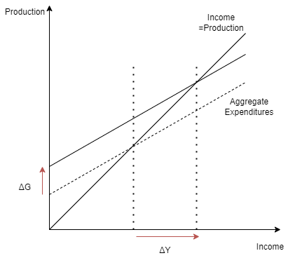

# Correction

## Exercise 1: Keynesian Cross

__Question 1__

The consumption given level of income $Y$ is:
$$C(Y) = c_0 + c_1 Y$$

When income increases by $\Delta Y$, consumption becomes:

$$C(Y+\Delta Y) = c_0 + c_1 \left( Y + \Delta Y \right)$$

The increase in consumption is

$$\Delta C = C(Y+\Delta Y) - C(Y) =  c_0 + c_1 \left( Y + \Delta Y \right) - \left(c_0 + c_1 Y\right)= c_1 \Delta Y$$

from which we get the marginal propensity to consume:[^footnote]

$$\frac{\Delta C}{\Delta Y}=c_1$$

__Question 2__

Assuming everything that is demanded is produced, we get the equilibrium equation:

$$\overline{Y} = C(\overline{Y}) + I + G$$

This equation defines *implicitly* an equilibrium production $\overline{Y}$. Since it assumes that production is perfectly elastic, this equilibrium production corresponds to the quantity that would prevail if production was determined by demand only.

Making the substitutions in the equation above gets us:

$$\overline{Y} = c_0 + c_1 \overline{Y} + i_0 + g_0$$

This equation can be solved for in $\overline{Y}$ to yield:

$$\overline{Y}=\frac{c_0 + i_0 + g_0}{1-c_1}$$

In the graphical representation, the x-axis represents different income. The 45 degrees line, represents the production which must be, in equilibrium, equal to income.

The aggregate expenditure curve corresponds to the quantities that agents, would be ready to consume at different hypothetical levels of income. It is the sum of all expenditure components, a.k.a. aggregate expenditure.

The intersection of the two curves defines the equilibrium. This diagram is known as the 45 degrees diagram or as the keynesian cross.

__Question 3__

When government spending increases, we can replace $g_0$ by $g_0+\Delta g_0$, in the above formula to get a new equilibrium output $\overline{Y}+\Delta Y$: 

$$\overline{Y}+\Delta Y=\frac{c_0 + i_0 + g_0 + \Delta G}{1-c_1}=\frac{c_0 + i_0 + g_0 }{1-c_1} + \frac{\Delta G}{1-c_1}=\overline{Y} + \frac{\Delta G}{1-c_1} $$

The increase in equilibrium output is thus: 

$$\Delta Y=\frac{\Delta G}{1-c_1} $$

The fiscal multiplier is the increase in output, that follows from one unit of government spending:

$$\frac{\Delta Y}{\Delta G}=\frac{1}{1-c_1} $$

Note that the equilibrium here is purely demand-determined. For this reason this multiplier is usually called the *keynesian multiplier*.

On the graph, the increase in government spending, implies an upward shift in the aggregate expenditure curve. This shift moves the equilibrium to a new level $\Delta Y$. We can see graphically there is a multiplier effect ($\Delta Y>\Delta G$) and more so when the aggregate expenditure curve is steeper.

There is a classical way to recover the value of the keynesian multiplier. Assume there are are many agents numbered by natural numbers. Assume they all have the same marginal propensity to consume $c$. Consider now the following chain of events:

- Government spends $\Delta G$ by giving it to individual 1. Income of individual 1 increases by $\Delta G$.
- Individual 1 spends a fraction $c$ of its new income by giving it to individual 2 (he saves the rest). Individual 2 receives $c \Delta G$.
- Individual 2 spends a fraction $c$ of its new income by giving it to individual 3. Individual 3 receives $c^2 \Delta G$.
- Individual 3 spends a fraction $c$ of its new income by giving it to individual 4. Individual 4 receives $c^3\Delta G$.
- ...

When we iterate we find that the total increase in income is:
$$\Delta Y = \Delta G + c \Delta G + c^2 \Delta G +  c^3 \Delta G \cdots = \Delta G \left( 1 + c + c^2 +  c^3 \cdots \right)$$

We recognize a geometric series with quotient $c$ and can compute the total increase in income as : 
$$\Delta Y = \frac{\Delta G}{1-c}$$

It is the same formula as before.

__Question 4__

In this question the government finances government spending with a tax on consumer's income $\Delta T=\Delta G$.

The new consumption is: 

$$C(Y+\Delta Y-\Delta T) = c_0 + c_1 \left( Y + \Delta Y - \Delta G\right)$$

and the new equilibrium condition is:

$$\begin{aligned}Y+\Delta Y & = & C(Y+\Delta Y-\Delta T) + I + G \\ & = &  c_0 + c_1 \left( Y + \Delta Y - \Delta G \right) + i_0  + g_0 + \Delta G \\ & = & Y + c_1 (\Delta Y - \Delta G) + \Delta G\end{aligned}$$

We get: 

$$\Delta Y = c_1 (\Delta Y - \Delta G) + \Delta G$$

which reduces to 

$$\Delta Y = \Delta G$$

In this case we can see that there is no multiplier effect (fiscal multiplier is 1). Note that it might sound surprising that the government can increase income at its will. This is because the equilibrium in this case is determined by demand, without production constraint. Hence it is natural that when the government increases its own demand, the equilibrium production is raised. What this calculation shows, is that when financed with an income tax, government spending does not induce additional demand from consumers.

In fact we can check that consumption hasn't changed:

$$C(Y+\Delta Y - \Delta T) = C(Y+\Delta Y - \Delta T) = C(Y+\Delta Y - \Delta G) = C(Y)$$