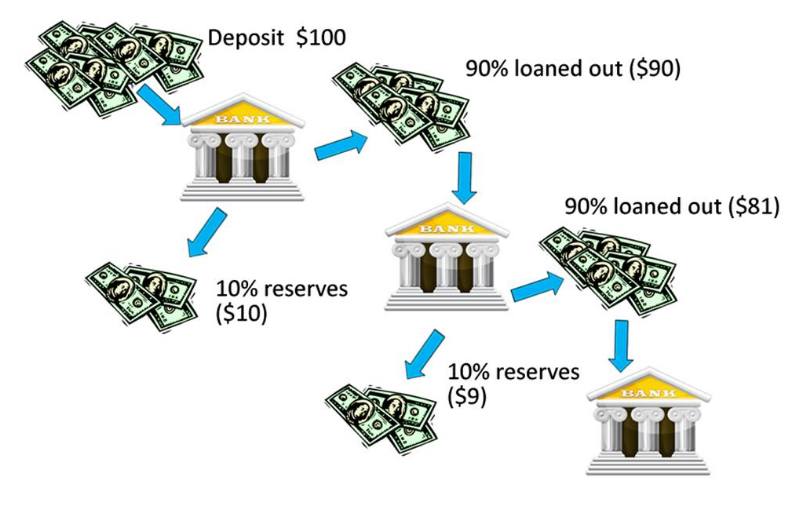
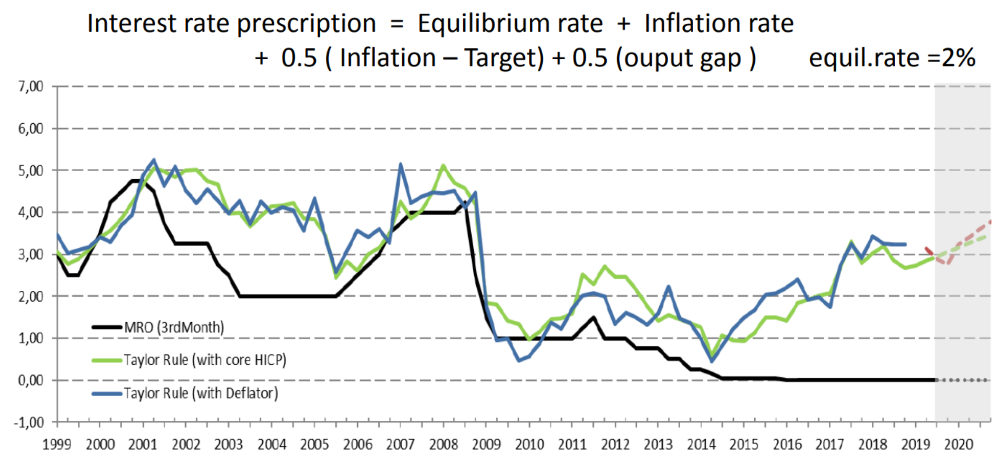
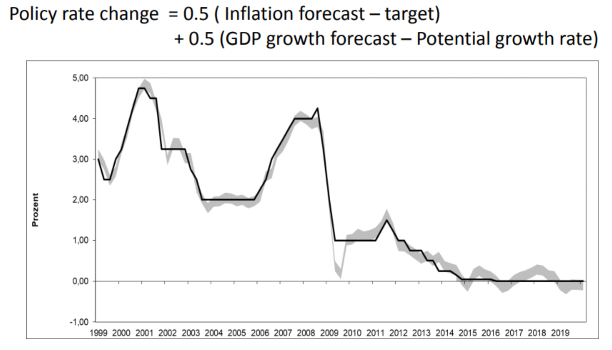
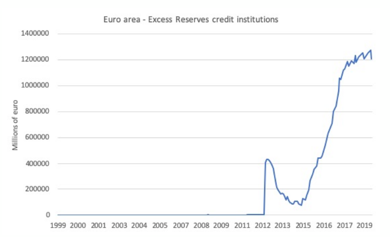

## Monetary Policy

::: columns

:::: column

### Sessions Program:

- Refresher and Introduction to AS/AD
- Aggregate Demand
- Aggregate Supply
- Sources of Fluctations
- Monetary Policy

::::

:::: column

### This Session

This Session:

- Tools of Monetary Policy
- Monetary Policy Implementation
  - Interest Rate Term Structure
  - Interbank Market

This is a recap session. Make sure you follow the overal approach and work on the intuitions.

::::

:::

<!-- Tools of Monpol -->

## Tools of Monetary Policy

What are the main tools of monetary policy?

- Open market operations
  - CB exchanges liquidities (cash) in exchange for more illiquid assets (gvt bonds)
  - CB lends in the interbank market

- Reserve requirement ratio

- Interest rates on reserves held by banks at the CB
  - Discount rate in the US
  - Main Refinancing Operations (MRO) in EZ

- Many other unconventional tools (not covered here)

## Money Supply / Monetary Base

Since “The General Theory of Employment, Interest and Prices” by J.M.Keynes, we know the amount of money circulating in the economy plays a role in the determination of prices and of inflation.

What is money? ECB lists several monetary aggregates:

  - M1: currency (coins, banknotes) in circulation and overnight deposits
  - M2: M1 + deposits with an agreed maturity of up to two years and deposits redeemable at - notice of up to three months
  - M3: M2 + repurchase agreements, money market fund shares/units and debt securities with maturity of up to two years 

- The monetary aggregates, contain financial assets of decreasing liquidity:
  - M1 is called monetary base
  - M2 is quasi money

## Controlling M1

\framesubtitle{Reminder: Fractional Reserve system}

{height=20%}

- Central Bank has the monopoly to create Central Bank Money
  - Coins, banknotes, digital euros…
  - To inject it, it exchanges it for less liquid assets
- But Monetary Base (M1) includes loans made by banks and credited to customers deposits.
  - Private banks create Money!
- Credit from private banks is limited by the reserve requirement ratio
  - Changing reserve ratio is a potential policy tool

## Controlling M1

 

Base money increased, credit not so much.\footnote{Source: ECB}
Credit multiplier has decreased and reserve requirements are not binding (reserve requirements were 2% until 2012, 1% since then)
The CB does not control broad money since the financial crisis.

## Evolution of Standard Policy Practices

## Inflation Targeting and the Taylor Rule

Most CBs have now switched to some form of "inflation targeting"
- the central bank tries to achieve a given inflation target (e.g. 2\% in EZ)

They achieve the target, by manipulating nominal interest rates:
- either by controlling the money supply
- or by setting interest rates directly

John Taylor, discovered empirically that interest rates decisions were well approximated (even before inflation targeting) by a "simple rule" of the form:

$$i_t = i^{\star} + 0.5 (\pi_t - \pi^ {\star}) + 0.5 (y_t - y_t^ {nt})$$

## Taylor Rule vs Effective Rate

## Taylor Rule vs Effective Rate

Source: Orphanides and Wieland

## The Taylor Rule

Original Taylor Rule is too simple

A version based on inflation expectations describes well CB decisions:

$$i_t = i^{\star} + \alpha_{\pi} (E_t \left[ \pi_{t+1} \right] - \pi^{\star}) + \alpha_y (y_t - y_t^ {nt})$$

This version is a good reference point to understand central bank's communication:
- it uses the "output gap" wording to describe economic outlook
- it tries to "anchor inflation expectations" by keeping them close to inflation target

## Monetary Policy Implementation

## Fisher Equation and Inflation Expectation

\framesubtitle{Reminder}

Recall the Fisher equation:

$$r_t = i_t - \pi_{t+1}$$

To be more precise, we should write:
$$r_t = i_t - E_t [\pi_{t+1}]$$

Because it is only the "expected" inflation that is known at date $t$. We omit the expectation sign, but keep in mind that $\pi_{t+1}$ represents expected inflation.

## Monetary rule and inflation expectation

We wrote real interest rule (MP) as follows:

$$r_t = r^ {\star} + \gamma (\pi_t - \overline{\pi})$$

But the CB does not directly control real interest rate. It controls the *nominal* interest rate $i_t$.

Now, take the Fisher equation $r_t = i_t - \pi_{t+1}$. We can replace it above to get:
$$i_t = r^{\star} + \gamma (\pi_t - \overline{\pi}) + \pi_{t+1}$$

We see that the central bank controls a combination of inflation and "expected inflation". Closer to a modern Taylor Rule.

That raises interesting deep questions: how does the CB manipulate inflation? For later...\footnote{Jedi Mind Trick: « These aren’t the droids you are looking for ». Matt O’Brian:  « Central Banks have a strong influence on market expectations »}

## Short Term Interest Rates

Actually, the CB doesn’t control $i_t$ directly (the quarterly or the yearly rate)
The CB controls instead very short-term interest rates typically overnight. Where does it happen?
On the *Interbank market*:

- Banks lend to each others reserves they hold on a Central Bank account
- Central bank is a price maker on this market
How does setting a short term interest rate affect the long run interest rate at any maturity (horizon)?
- Through the market’s ability to *arbitrage* between several investment options.

## Arbitrage

::: columns

:::: column

::::

:::: column

Arbitrage is a very generic concept

When two or more equivalent investment options yield different returns on investment, investors rush on the most profitable one... until returns equalize

So in equilibrium, all, equivalent investment options, must eventually have the same return.

Diffrences between rates of return are explained by differences in:

- risk characteristics
- liquidity

::::

:::

## Term Structure of Interst Rates

::: columns

:::: column

::::

:::: column

Apply the arbitrage principle to:

- A one year bond yielding $i_t^{1y}$
- Two 6 months bonds yielding (annualized)
  - $i_t^{6m}$ bought at date $t$
  - $i_{t+6m}^{6m}$ bought at date $t+6m$
- This provides us with two options to invest over 1 year.
- What is the arbitrage condition?

::::

:::

## Term Structure of Interest Rates

Invest value X at date $t$

Option 1 yields:

- $X(1+i^{1y})$ after one year
- (Gross) return is $(1+i^{1y})$

Option 2 yields (pay attention to the fact that returns are annualized)

- $X(1+i^{6m}_t)^{1/2}$ after 6 months
- $X(1+i^{6m}_t)^{1/2}(1+i^{t+6m}_{6m})^{1/2}$ after one year
- (Gross) Return is $(1+i^{6m}_t)^{1/2}(1+i^{t+6m}_{6m})^{1/2}$

## Term Structure of Interest Rates

The arbitrage equation would read: $$(1+i^{1y}) = (1+i^{6m}_t)^{1/2}(1+i^{t+6m}_{6m})^{1/2}$$
Or in log-terms: $i^{1y}_t = \frac{1}{2} i^ {6m}_t + \frac{1}{2} i^ {6m}_{t+6m}$
Given that investors are risk-averse and value the flexibility of having the cash sooner, they ask for a risk premium $\varphi$:
$$i^{1y} = \frac{1}{2} i^{6m}{t} + \frac{1}{2} i^ {6m}{t+6m} + \varphi$$

The risk premium incorporates the uncertainty about the fact that investment opportunities might change before one year, and about the possibility that 6-months interest rate might change before one year.

## Term Structure of Interest Rates

The same reasoning applies to the daily rate set by the central bank:

$$i^{1y}_t = \frac{1}{365} \left( i^{t}_{1d}  + i^{1d}_{t+1d}  + i^{1d}_{t+2d}i^{1d}_{t+2d} +  \cdots i^{1d}_{t+364d} \right) + \varphi$$

- By manipulating overnight interest rates (annualized term), the central bank can manipulate the yearly interest rate.
- It does so by announcing a path for future interest rates.
- For the manipulation to be effective, the path of future interest rates, must be clear and predictable as well as its potential adjustment to economic contingencies.
- This is one of the reason, the central bank tries to commit to a clear and transparent policy.

## Short Term Interest Rates

::: columns

:::: column

::::

:::: column

- Interest rates are reviewed at a regular basis (a few months).
- In general they evolve slowly, in a predictible way.
- US Fed let rates fluctuate within a band.
- Note that rates have stayed at historically low levels since 2008

::::

:::

## Short Term and Long Term Interest Rates

::: columns

:::: column

::::

:::: column

Overnight interst rates on the interbank market, affect longer maturities (3 months and 10 years)

Note that long term interst rates do not vary one to one with short term interest rates.

This is because long-term interest rates incorporate *future* changes in short term interest rates.

::::

:::

## Interest Rate on Reserves and the Interest Rate in the Interbank Market

- So, the CB, manipulates $r$ by manipulating $i$ by setting the i.r. on the interbank market...
- But how does the CB set the price on the interbank market ? 🤔

  - It is an equilibrium price, not directly decided by the CB.

- But first, what is the role of the interbank market?

  - When clients of a given bank trade with each other no money is leaving the bank
  - When a client of bank A pays a client of bank B, bank A should receive reserves from bank B
  - But in the same day there might be transactions from B to A to offset the first transaction.
  - At the end of the day imbalances to be corrected and banks need to pay each other
  - How?

## Interest Rate on Reserves and the Interest Rate in the Interbank Market

- To ensure they can make the transactions to settle imbalances:

  - Banks hold reserves at the CB to cover interbank payment when needed
  - And lend to each other on the interbank market

- There are two corresponding rates:

  - Reserves at the CB yield interest rate $i^R$. Set exogenously by the CB.
  - The market rate $i_M$

## Equilibrium in the Interbank Market

What determines the amount of reserves needed by banks?

- Whether it is more profitable to lend to other banks or to leave reserves at the CB
- How many transactions there are. This rises, with economic activity, that is $y$

*Demand* for reserve money:
$$R^d \left( \underbrace{i^M-i^R}_{-} , \underbrace{y}_{+}\right)$$

## Equilibrium in the Interbank Market

\framesubtitle{Supply and Equilibrium}

The Central Bank provides liquidities to banks through open market operations:

- banks exchange less liquid assets (bonds) in exchange for liquid central bank money (reserves)

__Supply__ for reserve money is *perfectly controlled* by the CB: $$R^s$$

## Equilibrium in the Interbank Market

Recall the equilibrium:

$$R^S = R^D \left(i^N - i^R, y \right)$$

Inverting this relation yields:

$$i^M = i^M\left(\underbrace{i^R}_{+}, y \underbrace{R_0}_{-} \right) \geq i_R$$

The central bank has *two* options to influence the interbank interest rate:

- set the interest rate on reserves
- introduce more CB money through open market policies

\footnote{Note: We always have $i^M>i^R$ otherwise there would be no interbank market since lending to the Central Bank would dominate completely lending to other banks (it is absolutely riskfree).}

## Equlibrium in the Interbank Market

The interest rate on reserves has become the main policy instrument. This is a consequence of the large excess (precautionary) reserves held by banks.

This is also true in the US where the CB remunerates excess reserves since 2008.

\footnote{Remark: the fact that $i^M\approx i^R$ when $R^0$ is very large is implied by the demand function for reserves from previous slide.}

## Takeaways

- Central Banks control interest rates through several policy tools
- Nowadays, it concentrates on setting the interst rate on the interbank market
- Controlling interest rate through money growth is less efficient because private banks don't lend enough and hold vast amounts of reserves at the central bank
- Nowadays, interest rates on reserves held by commercial banks at the central bank have become the main instrument of the central bank
- ... But recently, unconventional policies have brought back quantitative measures to the center stage.
